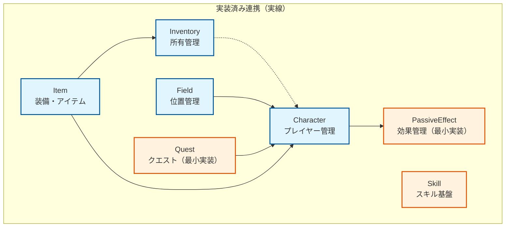
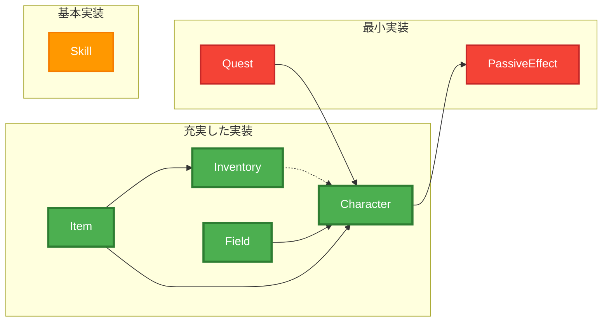

# ドメイン間相互作用

## 概要

BlackSmith.Domain における各ドメイン間の実装済み連携機能を説明します。\
現在の実装では基本的なデータ連携とID参照による関係性が構築されており、将来的な機能拡張の基盤となっています。

**実装状況**: 基本的なID参照と型制約による連携が実装済み。複雑な相互作用システムは将来的な拡張です。

## 実装済みドメイン連携

### 実装済み依存関係マップ

### 連携の詳細度別分類

### 主要な連携パターン

#### ID参照による連携
- **CharacterID**: Character ドメインのエンティティを他ドメインから参照
- **ItemID**: Item ドメインのアイテムをInventory ドメインで管理
- **SkillID**: Skill ドメインの識別子として使用
- **FieldID**: Field ドメインのフィールド識別に使用

#### 型制約による連携
- **IItem インターフェース**: Inventory ドメインで全アイテム種別を統一管理
- **EquippableItem**: Equipment Inventory で装備アイテム専用管理
- **ICraftMaterialItem/ICraftableItem**: Item ドメイン内でのクラフト関連型分類

### 実装済み連携の概要

#### 主要な連携関係
- **Character ⟷ Item**: CharacterID参照（制作者）、RequireParameter定義（装備要件）
- **Item ⟷ Inventory**: IItemインターフェース統合、型制約による管理分離
- **Field ⟷ Character**: CharacterID参照によるフィールド内位置管理
- **Quest ⟷ Character**: CharacterID参照による依頼人管理
- **Character ⟷ PassiveEffect**: BattleStatusEffectModule内包による効果統合
- **Currency(Inventory) ⟷ Item**: NPCItemShopでの通貨取引システム

詳細な実装内容は各ドメインのドキュメントを参照してください：
- [Character.md](../domains/Character.md)
- [Item.md](../domains/Item.md)
- [Inventory.md](../domains/Inventory.md)
- [Field.md](../domains/Field.md)
- [Quest.md](../domains/Quest.md)
- [PassiveEffect.md](../domains/PassiveEffect.md)

## 将来的な拡張ポイント

現在の実装は基本的なID参照と型制約による連携にとどまっており、以下の機能が将来的な拡張として考えられます：

### 高度な相互作用システム
- **装備効果システム**: 装備による戦闘パラメータ自動補正
- **スキル習得システム**: Character レベル・ステータスによるスキル習得条件チェック
- **クエスト進行管理**: 複数ドメインをまたぐ目標達成・進行状況追跡
- **パッシブ効果統合**: 装備・スキル・一時効果の統合計算

### データ整合性システム
- **トランザクション境界**: ドメイン横断操作の一貫性保証
- **イベント駆動連携**: ドメイン間の疎結合な通知・更新システム
- **循環依存回避**: インターフェース分離によるクリーンアーキテクチャ実現

### 動的システム
- **リアルタイム効果適用**: 状態変化による他ドメインへの即座な影響反映
- **条件チェック自動化**: 装備・スキル・クエスト要件の自動検証システム
- **統合バリデーション**: 複数ドメインにまたがるビジネスルール検証

現在の基本的な連携基盤により、これらの高度な機能を段階的に実装していくことが可能です。