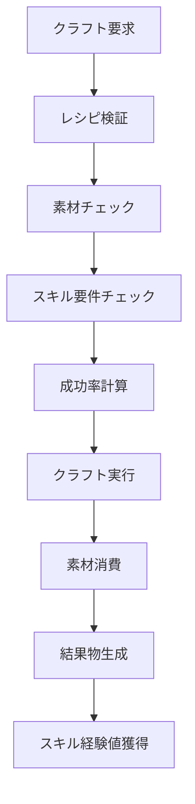

# クラフトシステム (Crafting System)【未実装】

## 概要

クラフトシステムは、Item、Inventory、Skill の3つのドメインを統合し、アイテムの作成・精錬・修理を管理するシステムです。

※ **現在、クラフトシステム全体が未実装です。**以下のドキュメントは設計上の仕様であり、実際の実装は存在しません。\
素材の管理、スキル要件のチェック、成功率の計算、結果物の生成を統合的に処理します。

## システム構成

### 関連ドメイン

- **[Item](../domains/Item.md)**: クラフトレシピ、素材、成果物
- **[Inventory](../domains/Inventory.md)**: 素材管理、結果物格納
- **[Skill](../domains/Skill.md)**: 生産スキル、熟練度、成功率

### 統合フロー



## クラフト統合サービス

### CraftingIntegrationService【未実装】
複数ドメインを統合したクラフト処理の中核サービス。

```csharp
// 【未実装】クラフト統合サービス - 設計上の仕様のみ
public class CraftingIntegrationService
{
    public CraftingResult ExecuteCrafting(
        PlayerCommonEntity player,
        InfiniteSlotInventory inventory,
        ICraftableItem targetItem)
    {
        // 1. レシピ検証
        var recipe = targetItem.Recipe;
        if (!ValidateRecipe(recipe))
        {
            return CraftingResult.Failed("Invalid recipe");
        }
        
        // 2. 素材チェック（Inventory ドメイン）
        if (!CanCraft(recipe, inventory))
        {
            return CraftingResult.Failed("Insufficient materials");
        }
        
        // 3. スキル要件チェック（Skill ドメイン）
        var requiredSkillType = DetermineRequiredSkillType(targetItem);
        var craftingSkill = GetCraftingSkill(player, requiredSkillType);
        
        if (craftingSkill == null)
        {
            return CraftingResult.Failed($"Required skill: {requiredSkillType}");
        }
        
        // 4. 成功率計算
        var successRate = CalculateSuccessRate(craftingSkill.Proficiency, targetItem);
        
        // 5. クラフト実行
        var isSuccess = DetermineSuccess(successRate);
        
        // 6. 結果処理
        var result = ProcessCraftingResult(
            player, inventory, recipe, targetItem, isSuccess, craftingSkill);
        
        return result;
    }
    
    private bool ValidateRecipe(CraftingRecipe recipe)
    {
        return recipe.RequiredMaterials.Any() && recipe.Products.Any();
    }
    
    private bool CanCraft(CraftingRecipe recipe, InfiniteSlotInventory inventory)
    {
        // Item ドメインのルールを適用
        foreach (var required in recipe.RequiredMaterials)
        {
            var availableQuantity = inventory.GetItemQuantity(required.Item);
            if (availableQuantity < required.Quantity)
                return false;
        }
        
        return true;
    }
    
    private ProductionType DetermineRequiredSkillType(ICraftableItem item)
    {
        // アイテム種別に基づく生産スキル判定
        return item switch
        {
            EquippableItem => ProductionType.Creation,
            ICraftMaterialItem => ProductionType.Refining,
            _ => ProductionType.Creation
        };
    }
    
    private SkillAndProficiency? GetCraftingSkill(PlayerCommonEntity player, ProductionType skillType)
    {
        return player.Skills.FirstOrDefault(s => 
            s.Skill is ProductionSkill ps && ps.ProductionType == skillType);
    }
    
    private float CalculateSuccessRate(SkillProficiency proficiency, ICraftableItem item)
    {
        // Skill ドメインのルールを適用
        return ProductionSkillService.CalculateCraftSuccessRate(proficiency, item);
    }
    
    private bool DetermineSuccess(float successRate)
    {
        return new Random().NextDouble() < successRate;
    }
    
    private CraftingResult ProcessCraftingResult(
        PlayerCommonEntity player,
        InfiniteSlotInventory inventory,
        CraftingRecipe recipe,
        ICraftableItem targetItem,
        bool isSuccess,
        SkillAndProficiency craftingSkill)
    {
        // 素材消費（必ず実行）
        var updatedInventory = ConsumeMaterials(inventory, recipe.RequiredMaterials);
        
        // 成功時の処理
        if (isSuccess)
        {
            // 結果物追加
            foreach (var product in recipe.Products)
            {
                updatedInventory = updatedInventory.AddItem(product.Item, product.Quantity);
            }
        }
        
        // スキル経験値獲得
        var experienceGain = ProductionSkillService.CalculateCraftExperience(targetItem, isSuccess);
        var updatedPlayer = SkillLearningService.ImproveSkill(
            player, craftingSkill.Skill.Name, experienceGain);
        
        return new CraftingResult(
            isSuccess,
            isSuccess ? "Crafting successful!" : "Crafting failed...",
            updatedPlayer,
            updatedInventory,
            isSuccess ? recipe.Products : ImmutableArray<ItemAndQuantity>.Empty
        );
    }
    
    private InfiniteSlotInventory ConsumeMaterials(
        InfiniteSlotInventory inventory,
        ImmutableArray<ItemAndQuantity> materials)
    {
        var result = inventory;
        foreach (var material in materials)
        {
            result = result.RemoveItem(material.Item, material.Quantity);
        }
        return result;
    }
}
```

## クラフト成功率システム【未実装】

### 熟練度ベース成功率【未実装】

```csharp
// 【未実装】クラフト成功率計算システム
public static class CraftingSuccessCalculator
{
    public static float CalculateBaseSuccessRate(SkillProficiency proficiency)
    {
        // 熟練度による基本成功率
        return proficiency.Value switch
        {
            >= 1 and <= 100 => 0.3f,      // 初心者: 30%
            >= 101 and <= 300 => 0.5f,    // 中級者: 50%
            >= 301 and <= 600 => 0.7f,    // 上級者: 70%
            >= 601 and <= 900 => 0.85f,   // 熟練者: 85%
            >= 901 and <= 1000 => 0.95f,  // 達人: 95%
            _ => 0.1f
        };
    }
    
    public static float ApplyItemComplexityModifier(float baseRate, ICraftableItem item)
    {
        // アイテムの複雑度による補正
        var complexity = DetermineItemComplexity(item);
        var modifier = complexity switch
        {
            ItemComplexity.Simple => 1.2f,    // +20%
            ItemComplexity.Normal => 1.0f,    // 変化なし
            ItemComplexity.Complex => 0.8f,   // -20%
            ItemComplexity.Expert => 0.6f,    // -40%
            ItemComplexity.Master => 0.4f,    // -60%
            _ => 1.0f
        };
        
        return Math.Max(0.05f, Math.Min(0.95f, baseRate * modifier));
    }
    
    public static float ApplyEnvironmentModifier(float baseRate, FieldID? currentField)
    {
        // 環境による補正（将来拡張）
        // 例: 特定の作業場での成功率向上
        return baseRate;
    }
    
    public static float ApplyEquipmentModifier(float baseRate, EquipmentInventory equipment)
    {
        // 装備による補正（将来拡張）
        // 例: 専用ツールによる成功率向上
        return baseRate;
    }
    
    private static ItemComplexity DetermineItemComplexity(ICraftableItem item)
    {
        // アイテム種別と必要素材数による複雑度判定
        var materialCount = item.Recipe.RequiredMaterials.Length;
        
        return (item, materialCount) switch
        {
            (EquippableItem equip, _) when equip.Enhancement.GetTotalEnhancement() > 50 => ItemComplexity.Master,
            (EquippableItem equip, _) when equip.Enhancement.GetTotalEnhancement() > 30 => ItemComplexity.Expert,
            (EquippableItem, _) when materialCount > 5 => ItemComplexity.Complex,
            (EquippableItem, _) when materialCount > 3 => ItemComplexity.Normal,
            (_, _) when materialCount > 3 => ItemComplexity.Complex,
            (_, _) when materialCount > 1 => ItemComplexity.Normal,
            _ => ItemComplexity.Simple
        };
    }
    
    public enum ItemComplexity
    {
        Simple,   // シンプル
        Normal,   // 普通
        Complex,  // 複雑
        Expert,   // 専門的
        Master    // 達人級
    }
}
```

## 特殊クラフトシステム【未実装】

### 強化クラフト【未実装】

```csharp
// 【未実装】強化クラフトサービス
public class EnhancementCraftingService
{
    public EnhancementResult EnhanceEquipment(
        EquippableItem baseEquipment,
        IEnumerable<ICraftMaterialItem> enhancementMaterials,
        SkillAndProficiency craftingSkill)
    {
        // 強化材料の検証
        if (!ValidateEnhancementMaterials(enhancementMaterials))
        {
            return EnhancementResult.Failed("Invalid enhancement materials");
        }
        
        // 強化効果計算
        var enhancement = CalculateEnhancementBonus(enhancementMaterials);
        
        // 成功率計算
        var successRate = CalculateEnhancementSuccessRate(
            baseEquipment, enhancement, craftingSkill.Proficiency);
        
        // 強化実行
        var isSuccess = new Random().NextDouble() < successRate;
        
        if (isSuccess)
        {
            var enhancedEquipment = ApplyEnhancement(baseEquipment, enhancement);
            return EnhancementResult.Success(enhancedEquipment);
        }
        else
        {
            // 失敗時のペナルティ（将来拡張）
            return EnhancementResult.Failed("Enhancement failed");
        }
    }
    
    private bool ValidateEnhancementMaterials(IEnumerable<ICraftMaterialItem> materials)
    {
        // 強化材料の種類・数量制限チェック
        return materials.Any() && materials.Count() <= 5;
    }
    
    private EnhancementBonus CalculateEnhancementBonus(IEnumerable<ICraftMaterialItem> materials)
    {
        // 材料に基づく強化ボーナス計算
        var totalBonus = materials.Aggregate(
            new EnhancementBonus(0, 0, 0, 0, 0),
            (acc, material) => acc + GetMaterialBonus(material)
        );
        
        return totalBonus;
    }
    
    private EnhancementBonus GetMaterialBonus(ICraftMaterialItem material)
    {
        // 材料種別による強化ボーナス（実装例）
        return material.ItemName switch
        {
            "鉄鉱石" => new EnhancementBonus(2, 1, 0, 1, 2),
            "魔法結晶" => new EnhancementBonus(1, 2, 3, 0, 1),
            "龍の鱗" => new EnhancementBonus(3, 1, 1, 1, 3),
            _ => new EnhancementBonus(1, 1, 1, 1, 1)
        };
    }
    
    private float CalculateEnhancementSuccessRate(
        EquippableItem equipment,
        EnhancementBonus bonus,
        SkillProficiency proficiency)
    {
        var baseRate = CraftingSuccessCalculator.CalculateBaseSuccessRate(proficiency);
        
        // 現在の強化レベルによる難易度上昇
        var currentEnhancement = equipment.Enhancement.GetTotalEnhancement();
        var difficultyPenalty = Math.Max(0.1f, 1.0f - (currentEnhancement * 0.01f));
        
        // 強化幅による難易度調整
        var bonusIntensity = bonus.GetTotalBonus();
        var intensityPenalty = Math.Max(0.5f, 1.0f - (bonusIntensity * 0.02f));
        
        return Math.Max(0.05f, baseRate * difficultyPenalty * intensityPenalty);
    }
    
    private EquippableItem ApplyEnhancement(EquippableItem equipment, EnhancementBonus bonus)
    {
        var currentEnhancement = equipment.Enhancement;
        var newEnhancement = new EnhancementParameter(
            currentEnhancement.Sharpness + bonus.Sharpness,
            currentEnhancement.Speed + bonus.Speed,
            currentEnhancement.Accuracy + bonus.Accuracy,
            currentEnhancement.Weight + bonus.Weight,
            currentEnhancement.Durability + bonus.Durability
        );
        
        return equipment with { Enhancement = newEnhancement };
    }
}

public record EnhancementBonus(int Sharpness, int Speed, int Accuracy, int Weight, int Durability)
{
    public int GetTotalBonus() => Sharpness + Speed + Accuracy + Weight + Durability;
    
    public static EnhancementBonus operator +(EnhancementBonus a, EnhancementBonus b) =>
        new(a.Sharpness + b.Sharpness, a.Speed + b.Speed, a.Accuracy + b.Accuracy,
            a.Weight + b.Weight, a.Durability + b.Durability);
}

public record EnhancementResult
{
    public bool IsSuccess { get; }
    public string Message { get; }
    public EquippableItem? EnhancedItem { get; }
    
    private EnhancementResult(bool isSuccess, string message, EquippableItem? item = null)
    {
        IsSuccess = isSuccess;
        Message = message;
        EnhancedItem = item;
    }
    
    public static EnhancementResult Success(EquippableItem item) =>
        new(true, "Enhancement successful!", item);
    
    public static EnhancementResult Failed(string reason) =>
        new(false, reason);
}
```

## 修理システム【未実装】

### 装備修理【未実装】（将来拡張）

```csharp
// 【未実装】修理システム
public class RepairCraftingService
{
    public RepairResult RepairEquipment(
        EquippableItem damagedEquipment,
        IEnumerable<ICraftMaterialItem> repairMaterials,
        SkillAndProficiency repairSkill)
    {
        // 耐久度システムが実装された際の修理処理
        // 現在は将来拡張として定義のみ
        
        throw new NotImplementedException("Repair system will be implemented when durability system is added");
    }
}
```

## 量産システム【未実装】

### バッチクラフト【未実装】

```csharp
// 【未実装】バッチクラフトサービス
public class BatchCraftingService
{
    public BatchCraftingResult ExecuteBatchCrafting(
        PlayerCommonEntity player,
        InfiniteSlotInventory inventory,
        ICraftableItem targetItem,
        int quantity)
    {
        if (quantity <= 0)
            throw new ArgumentException("Quantity must be positive");
        
        var results = new List<CraftingResult>();
        var currentPlayer = player;
        var currentInventory = inventory;
        
        for (int i = 0; i < quantity; i++)
        {
            // 素材チェック
            if (!CanCraft(targetItem.Recipe, currentInventory))
            {
                break; // 素材不足で終了
            }
            
            // 個別クラフト実行
            var craftingService = new CraftingIntegrationService();
            var result = craftingService.ExecuteCrafting(currentPlayer, currentInventory, targetItem);
            
            results.Add(result);
            
            // 結果反映
            if (result.IsSuccess)
            {
                currentPlayer = result.UpdatedPlayer;
                currentInventory = result.UpdatedInventory;
            }
            else
            {
                // 失敗時も素材は消費される
                currentInventory = ConsumeMaterials(currentInventory, targetItem.Recipe.RequiredMaterials);
            }
        }
        
        return new BatchCraftingResult(
            results,
            currentPlayer,
            currentInventory,
            results.Count(r => r.IsSuccess),
            results.Count
        );
    }
    
    private bool CanCraft(CraftingRecipe recipe, InfiniteSlotInventory inventory)
    {
        foreach (var required in recipe.RequiredMaterials)
        {
            if (inventory.GetItemQuantity(required.Item) < required.Quantity)
                return false;
        }
        return true;
    }
    
    private InfiniteSlotInventory ConsumeMaterials(
        InfiniteSlotInventory inventory,
        ImmutableArray<ItemAndQuantity> materials)
    {
        var result = inventory;
        foreach (var material in materials)
        {
            result = result.RemoveItem(material.Item, material.Quantity);
        }
        return result;
    }
}

public record BatchCraftingResult
{
    public IReadOnlyList<CraftingResult> IndividualResults { get; }
    public PlayerCommonEntity FinalPlayer { get; }
    public InfiniteSlotInventory FinalInventory { get; }
    public int SuccessCount { get; }
    public int TotalAttempts { get; }
    
    public BatchCraftingResult(
        IReadOnlyList<CraftingResult> results,
        PlayerCommonEntity finalPlayer,
        InfiniteSlotInventory finalInventory,
        int successCount,
        int totalAttempts)
    {
        IndividualResults = results;
        FinalPlayer = finalPlayer;
        FinalInventory = finalInventory;
        SuccessCount = successCount;
        TotalAttempts = totalAttempts;
    }
    
    public float SuccessRate => TotalAttempts > 0 ? (float)SuccessCount / TotalAttempts : 0f;
}
```

## 結果処理【未実装】

### CraftingResult【未実装】

```csharp
public record CraftingResult
{
    public bool IsSuccess { get; }
    public string Message { get; }
    public PlayerCommonEntity UpdatedPlayer { get; }
    public InfiniteSlotInventory UpdatedInventory { get; }
    public ImmutableArray<ItemAndQuantity> CreatedItems { get; }
    
    public CraftingResult(
        bool isSuccess,
        string message,
        PlayerCommonEntity updatedPlayer,
        InfiniteSlotInventory updatedInventory,
        ImmutableArray<ItemAndQuantity> createdItems)
    {
        IsSuccess = isSuccess;
        Message = message;
        UpdatedPlayer = updatedPlayer;
        UpdatedInventory = updatedInventory;
        CreatedItems = createdItems;
    }
    
    public static CraftingResult Failed(string reason) =>
        new CraftingResult(false, reason, null!, null!, ImmutableArray<ItemAndQuantity>.Empty);
}
```

## レシピ管理【未実装】

### レシピ発見システム【未実装】（将来拡張）

```csharp
public interface IRecipeDiscoveryService
{
    IEnumerable<CraftingRecipe> GetAvailableRecipes(PlayerCommonEntity player);
    bool TryLearnRecipe(PlayerCommonEntity player, CraftingRecipe recipe);
}

public class SkillBasedRecipeDiscovery : IRecipeDiscoveryService
{
    public IEnumerable<CraftingRecipe> GetAvailableRecipes(PlayerCommonEntity player)
    {
        // スキルレベルに基づくレシピ開放
        var productionSkills = player.Skills
            .Where(s => s.Skill.Type == SkillType.Production)
            .ToList();
        
        // 実装は将来拡張
        return Enumerable.Empty<CraftingRecipe>();
    }
    
    public bool TryLearnRecipe(PlayerCommonEntity player, CraftingRecipe recipe)
    {
        // レシピ学習条件チェック
        return false; // 将来実装
    }
}
```

## 拡張ポイント【未実装】

### 自動クラフトシステム【未実装】
```csharp
public class AutoCraftingService
{
    public void SetupAutoCrafting(
        PlayerCommonEntity player,
        ICraftableItem targetItem,
        int targetQuantity,
        TimeSpan interval)
    {
        // 定期的な自動クラフト実行
    }
}
```

### クラフト品質システム【未実装】
```csharp
public enum CraftQuality
{
    Poor, Normal, Good, Excellent, Perfect
}

public record QualifiedCraftingResult : CraftingResult
{
    public CraftQuality Quality { get; }
    public float QualityMultiplier { get; }
}
```

クラフトシステムは、アイテム作成を通じてプレイヤーの成長と経済活動を促進する重要なシステムです。\
複数ドメインの連携により、深いゲームプレイ体験を提供します。