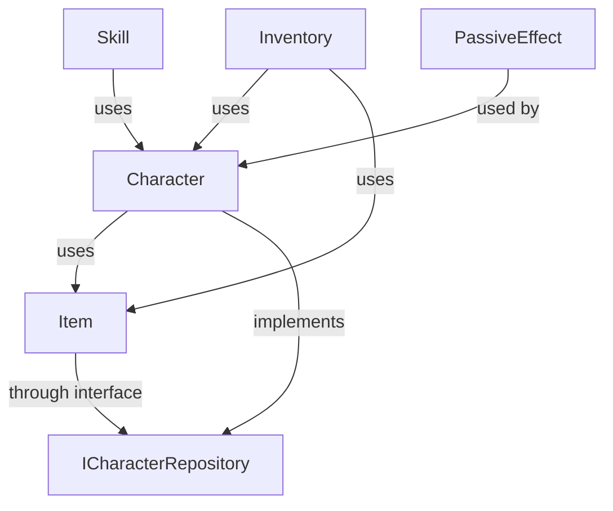

# BlackSmith.Domain アーキテクチャ設計

## アーキテクチャ概要

BlackSmith.Domain は**ドメイン駆動設計（DDD）**と**クリーンアーキテクチャ**の原則に基づいて設計されています。  
ドメインロジックをインフラストラクチャから分離し、テスタビリティと保守性を重視した構造になっています。

## レイヤー構成

### 1. ドメイン層（Domain Layer）
**場所**: `Assets/Plugins/BlackSmith.Domain/Domain/`

#### 責務
- コアビジネスロジックの実装
- ドメインエンティティ・値オブジェクトの定義
- ビジネスルールの表現
- ドメインイベントの定義

#### 主要構成要素

```
Domain/
├── Character/         # プレイヤー・戦闘システム
├── Item/              # アイテム・装備システム
├── Inventory/         # インベントリ・通貨システム
├── Field/             # 世界・フィールドシステム
├── Skill/             # スキルシステム
├── PassiveEffect/     # ステータス効果システム
└── Quest/             # クエストシステム
```

### 2. ユースケース層（Application Layer）
**場所**: `Assets/Plugins/BlackSmith.Domain/Usecase/`

#### 責務
- アプリケーション固有のビジネスロジック
- ドメインオブジェクトのオーケストレーション
- 外部システムとの統合インターフェース
- トランザクション境界の定義

#### 主要構成要素

```
Usecase/
├── Character/        # キャラクター操作ユースケース
├── Item/             # アイテム操作ユースケース
├── Inventory/        # インベントリ操作ユースケース
└── Repository/       # リポジトリインターフェース定義
```

### 3. テスト層（Test Layer）
**場所**: `Assets/Plugins/BlackSmith.Domain/Tests/`

#### 構成
- **ドメインテスト**: 22ファイル（エンティティ、値オブジェクト、モジュール）
- **ユースケーステスト**: 5ファイル（主要シナリオ）

## 設計パターン

### 1. 値オブジェクト（Value Object）

```csharp
// record型による不変オブジェクト
public abstract record BasicID
{
    protected abstract string Prefix { get; }
    public string Value => Prefix + guid;
    private Guid guid { get; }
}

public record Experience
{
    public int Value { get; }
    public Experience(int value) => Value = Math.Max(0, value);
}
```

**特徴**:
- record型による構造的等価性
- 不変性の保証
- メソッドチェーンによる状態変更

### 2. ファクトリーパターン

```csharp
public static class PlayerFactory
{
    public static PlayerCommonEntity CreateNew(
        PlayerCommonCreateCommand command)
    {
        // エンティティ作成ロジック
    }
    
    public static PlayerCommonEntity Reconstruct(
        PlayerCommonReconstructCommand command)
    {
        // エンティティ再構築ロジック
    }
}
```

**用途**:
- エンティティ作成の複雑性を隠蔽
- 作成・再構築の責務分離
- ビジネスルールの一元化

### 3. コマンドパターン

```csharp
public record PlayerCommonCreateCommand
{
    public PlayerName Name { get; }
    public PlayerLevel Level { get; }
    public Strength Strength { get; }
    public Agility Agility { get; }
}

public record PlayerCommonReconstructCommand
{
    public PlayerID Id { get; }
    public PlayerName Name { get; }
    // ... その他のプロパティ
}
```

**用途**:
- エンティティ再構築時のデータ転送
- パラメータオブジェクトパターンの実装
- データバリデーションの一元化

### 4. リポジトリパターン

```csharp
public interface IPlayerCommonEntityRepository
{
    UniTask<PlayerCommonEntity> FindByIdAsync(PlayerID id);
    UniTask SaveAsync(PlayerCommonEntity entity);
    UniTask DeleteAsync(PlayerID id);
}
```

**特徴**:
- データアクセスの抽象化
- ドメイン層の独立性保持
- テスタビリティの向上

### 5. モジュールパターン

```csharp
public class CharacterBattleModule
{
    private readonly BattleEquipmentModule equipmentModule;
    private readonly BattleStatusEffectModule statusEffectModule;
    
    public BattleParameter GetBattleParameter()
    {
        // 複数モジュールの統合処理
    }
}
```

**用途**:
- 関連機能の凝集
- 複雑なビジネスロジックの分割
- 単一責任原則の実現

## 依存関係の管理

### 1. 依存関係逆転の原則（DIP）

```csharp
// ドメイン層: インターフェース定義
public interface IPlayerCommonEntityRepository { }

// ユースケース層: インターフェース使用
public class PlayerCommonEntityProvideUsecase
{
    private readonly IPlayerCommonEntityRepository repository;
}

// インフラ層: 具象実装（プロジェクト外で実装）
public class PlayerCommonEntityRepository : IPlayerCommonEntityRepository { }
```

### 2. 循環依存の回避



**手法**:
- インターフェース分離
- コマンドオブジェクトによるデータ転送
- イベント駆動による疎結合

## 非機能要件への対応

### 1. 非同期処理

```csharp
// UniTaskによる非同期処理
public class PlayerCommonEntityProvideUsecase
{
    public async UniTask<PlayerCommonEntity> ExecuteAsync(PlayerID id)
    {
        return await repository.FindByIdAsync(id);
    }
}
```

### 2. リアクティブプログラミング

```csharp
// R3によるイベント駆動
public class PlayerEventPublisher
{
    private readonly Subject<PlayerLevelUpEvent> levelUpSubject = new();
    public Observable<PlayerLevelUpEvent> OnLevelUp => levelUpSubject;
}
```

### 3. パフォーマンス

```csharp
// イミュータブルコレクションによる効率的な状態管理
public record PlayerCommonEntity
{
    public ImmutableArray<SkillAndProficiency> Skills { get; }
}
```

## セキュリティ設計

### 1. 不変性の保証

- record型による構造的不変性
- privateコンストラクタによる生成制御
- 防御的コピーの実装

### 2. バリデーション

```csharp
public record PlayerLevel
{
    public int Value { get; }
    
    public PlayerLevel(int value)
    {
        if (value < 1) throw new ArgumentException("Level must be 1 or greater");
        Value = value;
    }
}
```

### 3. カプセル化

```csharp
public record PlayerCommonEntity
{
    private readonly PlayerLevel level;
    private readonly Experience experience;
    
    // 外部からは制御されたメソッドのみ公開
    public PlayerCommonEntity LevelUp() => this with 
    { 
        level = new PlayerLevel(level.Value + 1),
        experience = new Experience(0)
    };
}
```

## 拡張性設計

### 1. オープン/クローズド原則

```csharp
// 抽象基底クラス
public abstract record Skill
{
    public abstract SkillType Type { get; }
}

// 拡張クラス
public record BattleSkill : Skill
{
    public override SkillType Type => SkillType.Battle;
}

public record ProductionSkill : Skill
{
    public override SkillType Type => SkillType.Production;
}
```

### 2. 戦略パターン

```csharp
public interface IExperienceCalculator
{
    int CalculateRequiredExperience(int level);
}

public class StandardExperienceCalculator : IExperienceCalculator
{
    public int CalculateRequiredExperience(int level)
    {
        // 標準計算ロジック
    }
}
```

## パッケージ構成

### Unity Package Manager 対応

```json
{
  "name": "com.cactus.blacksmith-domain",
  "version": "1.3.1",
  "displayName": "BlackSmith Domain",
  "description": "Domain layer for BlackSmith game project",
  "unity": "2023.2",
  "dependencies": {
    "com.cysharp.unitask": "2.5.5",
    "com.cysharp.r3": "1.2.8",
    "com.unity.nuget.newtonsoft-json": "3.2.1"
  }
}
```

### アセンブリ定義

- **BlackSmith.Domain.asmdef**: ドメイン層
- **BlackSmith.Domain.Test.asmdef**: テスト層

## 設計原則への準拠

### SOLID原則

1. **S**ingle Responsibility: 各クラスは単一の責務
2. **O**pen/Closed: 拡張に開かれ、変更に閉じている
3. **L**iskov Substitution: 派生型は基底型と置換可能
4. **I**nterface Segregation: インターフェースの分離
5. **D**ependency Inversion: 依存関係の逆転

### DDD戦術パターン

- **エンティティ**: 一意性を持つオブジェクト
- **値オブジェクト**: 不変な値を表現
- **ドメインサービス**: エンティティに属さないロジック
- **ファクトリー**: 複雑な生成ロジック
- **リポジトリ**: 永続化の抽象化

この設計により、BlackSmith.Domain は拡張性、保守性、テスタビリティを兼ね備えた堅牢なドメインライブラリとなっています。