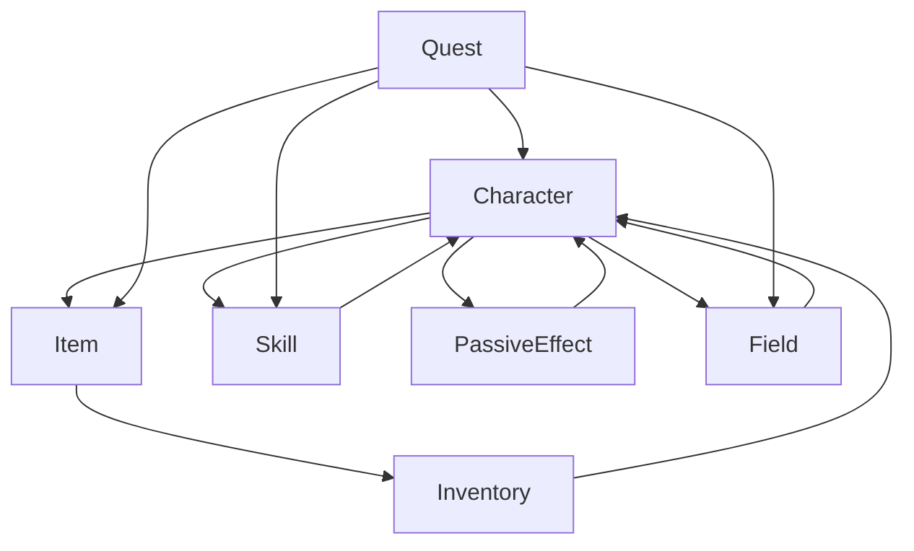

# ドメイン間相互作用

## 概要

BlackSmith.Domain における7つのドメイン間の依存関係、データフロー、相互作用パターンを詳細に説明します。\
各ドメインがどのように連携し、システム全体の整合性を保っているかを示します。

**実装状況**: 【部分実装】基本的な依存関係は実装済み。複雑な相互作用パターンは未実装。

## ドメイン依存関係マップ

### 全体依存関係図



### 依存関係レベル

#### レベル1（基盤ドメイン）
- **Item**: 他ドメインから参照される基盤
- **Field**: 位置・空間の基盤
- **Skill**: 能力システムの基盤

#### レベル2（管理ドメイン）
- **Inventory**: Itemを管理
- **PassiveEffect**: 効果システム管理

#### レベル3（統合ドメイン）
- **Character**: 多くのドメインを統合
- **Quest**: 複数ドメインを横断

## ドメイン間データフロー

### 1. Character ⟷ Item 相互作用 【部分実装】

#### データフロー
```
Character → Item: 装備条件チェック
Item → Character: 装備効果適用
Character → Item: 装備変更要求
Item → Character: 戦闘パラメータ補正
```

#### 主要インターフェース 【未実装】
```csharp
// Character から Item への要求
public interface IEquipmentRequirementChecker
{
    bool CanEquip(PlayerCommonEntity player, EquippableItem equipment);
    string GetRestrictionReason(PlayerCommonEntity player, EquippableItem equipment);
}

// Item から Character への効果提供
public interface IEquipmentEffectProvider
{
    BattleParameter CalculateEquipmentBonus(EquipmentInventory equipment);
    IEnumerable<BattleStatusEffect> GetEquipmentEffects(EquipmentInventory equipment);
}
```

#### 具体的な相互作用例 【未実装】
```csharp
public class CharacterItemInteraction
{
    public EquipmentChangeResult ChangeEquipment(
        PlayerCommonEntity player,
        EquippableItem newEquipment)
    {
        // 1. Character ドメイン: 装備条件チェック
        if (!CanEquipByLevel(player, newEquipment))
            return EquipmentChangeResult.Failed("Level requirement not met");
        
        if (!CanEquipByStats(player, newEquipment))
            return EquipmentChangeResult.Failed("Stat requirement not met");
        
        // 2. Item ドメイン: 装備効果計算
        var newBattleParams = CalculateBattleParametersWithEquipment(player, newEquipment);
        
        return EquipmentChangeResult.Success(newBattleParams);
    }
    
    private bool CanEquipByLevel(PlayerCommonEntity player, EquippableItem equipment)
    {
        // Character ドメインのレベル制限ロジック 【未実装】
        return true; // 将来実装
    }
    
    private bool CanEquipByStats(PlayerCommonEntity player, EquippableItem equipment)
    {
        // Character ドメインのステータス制限ロジック 【未実装】
        return true; // 将来実装
    }
    
    private BattleParameter CalculateBattleParametersWithEquipment(
        PlayerCommonEntity player,
        EquippableItem equipment)
    {
        // Character の基本パラメータ + Item の装備効果
        var baseParams = new BattleParameter(
            player.Level.Value * 10,
            (player.Strength.Value + player.Agility.Value) * 2,
            (player.Strength.Value + player.Agility.Value) * 2
        );
        
        var equipmentBonus = new BattleParameter(
            0,
            equipment.Enhancement.GetAttackValue(),
            equipment.Enhancement.GetDefenseValue()
        );
        
        return baseParams + equipmentBonus;
    }
}
```

### 2. Character ⟷ Skill 相互作用 【未実装】

#### データフロー
```
Character → Skill: 習得条件チェック、熟練度による効果計算
Skill → Character: スキル効果適用、成長補正
Character ⟷ Skill: 経験値・熟練度相互更新
```

#### 相互作用パターン 【未実装】
```csharp
public class CharacterSkillInteraction
{
    public SkillLearningResult TryLearnSkill(
        PlayerCommonEntity player,
        Skill targetSkill)
    {
        // Character ドメイン: 習得条件チェック
        var conditions = targetSkill.AcquisitionConditions;
        
        if (player.Level.Value < conditions.Level.Value)
            return SkillLearningResult.Failed("Insufficient level");
        
        if (player.Strength.Value < conditions.Strength.Value)
            return SkillLearningResult.Failed("Insufficient strength");
        
        if (player.Agility.Value < conditions.Agility.Value)
            return SkillLearningResult.Failed("Insufficient agility");
        
        // Skill ドメイン: 前提スキル確認
        foreach (var requiredSkill in conditions.RequiredSkills)
        {
            var playerSkill = player.Skills.FirstOrDefault(s => 
                s.Skill.Name.Value == requiredSkill.Skill.Name.Value);
            
            if (playerSkill == null || 
                playerSkill.Proficiency.Value < requiredSkill.Proficiency.Value)
            {
                return SkillLearningResult.Failed($"Required skill: {requiredSkill.Skill.Name.Value}");
            }
        }
        
        // Character ドメイン: スキル追加
        var updatedPlayer = player.LearnSkill(targetSkill, new SkillProficiency(1));
        
        return SkillLearningResult.Success(updatedPlayer);
    }
    
    public BattleParameter ApplySkillEffects(
        PlayerCommonEntity player,
        BattleParameter baseParams)
    {
        var battleSkills = player.Skills
            .Where(s => s.Skill is BattleSkill)
            .Cast<SkillAndProficiency>();
        
        var totalAttackBonus = 0;
        var totalDefenseBonus = 0;
        
        foreach (var skillData in battleSkills)
        {
            var battleSkill = (BattleSkill)skillData.Skill;
            var proficiencyMultiplier = skillData.Proficiency.Value / 1000.0f;
            
            totalAttackBonus += (int)(battleSkill.Effect.AttackBonus * proficiencyMultiplier);
            totalDefenseBonus += (int)(battleSkill.Effect.DefenseBonus * proficiencyMultiplier);
        }
        
        return new BattleParameter(
            baseParams.MaxHealth,
            baseParams.AttackValue + totalAttackBonus,
            baseParams.DefenseValue + totalDefenseBonus
        );
    }
}
```

### 3. Character ⟷ PassiveEffect 相互作用 【未実装】

#### データフロー
```
Character → PassiveEffect: 現在ステータスの参照
PassiveEffect → Character: ステータス補正・効果適用
PassiveEffect ⟷ Character: 効果持続時間管理
```

#### 効果適用パターン 【未実装】
```csharp
public class CharacterEffectInteraction
{
    public BattleParameter ApplyEffectsToCharacter(
        PlayerCommonEntity player,
        EffectCollection effects)
    {
        // Character ドメイン: 基本パラメータ
        var baseParams = new BattleParameter(
            player.Level.Value * 10,
            (player.Strength.Value + player.Agility.Value) * 2,
            (player.Strength.Value + player.Agility.Value) * 2
        );
        
        // PassiveEffect ドメイン: 効果統合
        var combinedEffect = effects.GetCombinedEffect();
        
        // 統合計算
        return new BattleParameter(
            Math.Max(1, baseParams.MaxHealth + combinedEffect.MaxHealth),
            Math.Max(1, baseParams.AttackValue + combinedEffect.Attack),
            Math.Max(0, baseParams.DefenseValue + combinedEffect.Defense)
        );
    }
    
    public float CalculateExperienceMultiplier(
        PlayerCommonEntity player,
        EffectCollection effects)
    {
        // PassiveEffect ドメイン: 経験値倍率効果
        var combinedEffect = effects.GetCombinedEffect();
        var baseMultiplier = combinedEffect.ExperienceMultiplier;
        
        // Character ドメイン: レベルによる補正（将来拡張）
        var levelMultiplier = 1.0f;
        
        return baseMultiplier * levelMultiplier;
    }
    
    public EffectCollection ProcessCharacterLevelUp(
        PlayerCommonEntity oldPlayer,
        PlayerCommonEntity newPlayer,
        EffectCollection effects)
    {
        var levelUpsGained = newPlayer.Level.Value - oldPlayer.Level.Value;
        
        if (levelUpsGained <= 0)
            return effects;
        
        // レベルアップによる特殊効果付与
        var levelUpEffect = EffectFactory.CreateExperienceBoost(1.2f, 10);
        
        return effects.AddEffect(levelUpEffect);
    }
}
```

### 4. Item ⟷ Inventory 相互作用 【部分実装】

#### データフロー
```
Item → Inventory: アイテム特性情報（スタック制限、種別等）
Inventory → Item: 所有・管理情報
Item ⟷ Inventory: アイテム移動・変更通知
```

#### 管理パターン 【部分実装】
```csharp
public class ItemInventoryInteraction
{
    public bool CanAddItem(IItem item, int quantity, BaseInventory inventory)
    {
        // Item ドメイン: アイテム特性確認
        var maxStackSize = GetMaxStackSize(item);
        
        // Inventory ドメイン: 容量・制限確認
        return inventory.CanAddItem(item, quantity) && quantity <= maxStackSize;
    }
    
    public InventoryUpdateResult MoveItem(
        IItem item,
        int quantity,
        BaseInventory fromInventory,
        BaseInventory toInventory)
    {
        // 移動可能性チェック
        if (fromInventory.GetItemQuantity(item) < quantity)
            return InventoryUpdateResult.Failed("Insufficient quantity in source");
        
        if (!toInventory.CanAddItem(item, quantity))
            return InventoryUpdateResult.Failed("Cannot add to destination");
        
        // Item ドメイン: 移動制限チェック
        if (!CanMoveItemType(item, fromInventory, toInventory))
            return InventoryUpdateResult.Failed("Item type cannot be moved");
        
        // Inventory ドメイン: 実際の移動処理
        var updatedFrom = fromInventory.RemoveItem(item, quantity);
        var updatedTo = toInventory.AddItem(item, quantity);
        
        return InventoryUpdateResult.Success(updatedFrom, updatedTo);
    }
    
    private int GetMaxStackSize(IItem item)
    {
        // Item ドメインのスタック制限ルール 【部分実装】
        return item switch
        {
            ICraftMaterialItem => 999,
            EquippableItem => 1,
            _ => 99
        };
    }
    
    private bool CanMoveItemType(IItem item, BaseInventory from, BaseInventory to)
    {
        // アイテム移動制限ロジック 【部分実装】
        return (from, to, item) switch
        {
            (EquipmentInventory, InfiniteSlotInventory, EquippableItem) => true,
            (InfiniteSlotInventory, EquipmentInventory, EquippableItem) => true,
            (InfiniteSlotInventory, InfiniteSlotInventory, _) => true,
            _ => false
        };
    }
}
```

### 5. Quest → 複数ドメイン 統合相互作用 【未実装】

#### データフロー
```
Quest → Character: レベル・ステータス要件確認
Quest → Item: 収集・配達アイテム管理
Quest → Field: 位置・移動目標設定
Quest → Skill: スキル習得・使用条件
Character/Item/Field/Skill → Quest: 進行状況更新
```

#### 統合管理パターン 【未実装】
```csharp
public class QuestDomainIntegration
{
    public QuestProgressResult UpdateQuestProgress(
        QuestModel quest,
        PlayerCommonEntity player,
        InfiniteSlotInventory inventory,
        FieldID currentField)
    {
        var updatedQuest = quest;
        var progressMade = false;
        
        foreach (var objective in quest.Objectives)
        {
            if (objective.IsCompleted)
                continue;
            
            var newProgress = objective.Type switch
            {
                // Character ドメイン連携
                ObjectiveType.AchieveLevel => CheckLevelObjective(objective, player),
                
                // Item/Inventory ドメイン連携
                ObjectiveType.CollectItems => CheckCollectionObjective(objective, inventory),
                
                // Field ドメイン連携
                ObjectiveType.ReachLocation => CheckLocationObjective(objective, currentField),
                
                // Skill ドメイン連携
                ObjectiveType.LearnSkill => CheckSkillObjective(objective, player),
                
                _ => objective
            };
            
            if (newProgress.CurrentProgress > objective.CurrentProgress)
            {
                updatedQuest = UpdateQuestObjective(updatedQuest, newProgress);
                progressMade = true;
            }
        }
        
        // 完了チェック
        if (updatedQuest.AllObjectivesCompleted() && updatedQuest.Status == QuestStatus.InProgress)
        {
            updatedQuest = updatedQuest.Complete();
        }
        
        return new QuestProgressResult(updatedQuest, progressMade);
    }
    
    private QuestObjective CheckLevelObjective(QuestObjective objective, PlayerCommonEntity player)
    {
        // レベル目標確認ロジック 【未実装】
        var targetLevel = ExtractTargetLevel(objective.Description.Value);
        var currentProgress = Math.Min(targetLevel, player.Level.Value);
        
        return objective.UpdateProgress(currentProgress);
    }
    
    private QuestObjective CheckCollectionObjective(QuestObjective objective, InfiniteSlotInventory inventory)
    {
        // アイテム収集目標確認ロジック 【未実装】
        var (targetItem, requiredQuantity) = ExtractCollectionTarget(objective.Description.Value);
        var currentQuantity = inventory.GetItemQuantity(targetItem);
        var progress = Math.Min(requiredQuantity, currentQuantity);
        
        return objective.UpdateProgress(progress);
    }
    
    private QuestObjective CheckLocationObjective(QuestObjective objective, FieldID currentField)
    {
        // 位置目標確認ロジック 【未実装】
        var targetField = ExtractTargetField(objective.Description.Value);
        var progress = currentField == targetField ? 1 : 0;
        
        return objective.UpdateProgress(progress);
    }
    
    private QuestObjective CheckSkillObjective(QuestObjective objective, PlayerCommonEntity player)
    {
        // スキル目標確認ロジック 【未実装】
        var (targetSkill, requiredProficiency) = ExtractSkillTarget(objective.Description.Value);
        var playerSkill = player.Skills.FirstOrDefault(s => s.Skill.Name.Value == targetSkill);
        
        if (playerSkill == null)
            return objective;
        
        var progress = Math.Min(requiredProficiency, playerSkill.Proficiency.Value);
        return objective.UpdateProgress(progress);
    }
}
```

## 循環依存の回避戦略 【未実装】

### 1. インターフェース分離原則（ISP） 【未実装】

```csharp
// Character ドメインが Item ドメインに依存せず、抽象に依存 【未実装】
public interface IEquipmentEffectCalculator
{
    BattleParameter CalculateEquipmentBonus(EquipmentInventory equipment);
}

// 具象実装は上位層で注入 【未実装】
public class ItemBasedEquipmentEffectCalculator : IEquipmentEffectCalculator
{
    public BattleParameter CalculateEquipmentBonus(EquipmentInventory equipment)
    {
        // Item ドメインのロジックを使用 【未実装】
        return CalculateFromEnhancements(equipment);
    }
}
```

### 2. イベント駆動による疎結合 【未実装】

```csharp
// ドメインイベントによる通知 【未実装】
public record PlayerLevelUpEvent(PlayerID PlayerId, int NewLevel, int OldLevel);
public record ItemEquippedEvent(PlayerID PlayerId, EquippableItem Item);
public record SkillImprovedEvent(PlayerID PlayerId, SkillName SkillName, int NewProficiency);

// イベントハンドラーでドメイン間連携 【未実装】
public class CrossDomainEventHandler
{
    public void Handle(PlayerLevelUpEvent evt)
    {
        // Quest ドメイン: レベル目標確認 【未実装】
        // PassiveEffect ドメイン: レベルアップバフ適用 【未実装】
        // Skill ドメイン: 新規習得可能スキル確認 【未実装】
    }
    
    public void Handle(ItemEquippedEvent evt)
    {
        // Character ドメイン: 戦闘パラメータ再計算 【未実装】
        // PassiveEffect ドメイン: 装備効果適用 【未実装】
    }
}
```

### 3. コマンドパターンによるデータ転送 【未実装】

```csharp
// ドメイン間でのデータ受け渡しはコマンドオブジェクト経由 【未実装】
public record CrossDomainCommand
{
    public PlayerID PlayerId { get; }
    public CommandType Type { get; }
    public IReadOnlyDictionary<string, object> Parameters { get; }
}

// 各ドメインは自身のコマンドのみ処理 【未実装】
public class CharacterCommandHandler
{
    public void Handle(CrossDomainCommand command)
    {
        if (command.Type == CommandType.UpdateBattleParameters)
        {
            // Character ドメイン内部の処理のみ実行 【未実装】
        }
    }
}
```

## データ整合性保証 【未実装】

### 1. トランザクション境界 【未実装】

```csharp
// ドメイン横断トランザクション管理 【未実装】
public class DomainTransactionService
{
    public async Task<DomainTransactionResult> ExecuteTransactionAsync(
        Func<DomainTransactionContext, Task<DomainTransactionResult>> operation)
    {
        var context = new DomainTransactionContext();
        
        try
        {
            var result = await operation(context);
            
            if (result.IsSuccess)
            {
                await context.CommitAsync();
            }
            else
            {
                await context.RollbackAsync();
            }
            
            return result;
        }
        catch (Exception ex)
        {
            await context.RollbackAsync();
            return DomainTransactionResult.Failed(ex.Message);
        }
    }
}

// 使用例: 装備変更時の複数ドメイン更新 【未実装】
public async Task<EquipmentChangeResult> ChangeEquipmentSafelyAsync(
    PlayerCommonEntity player,
    EquippableItem newEquipment)
{
    return await transactionService.ExecuteTransactionAsync(async context =>
    {
        // 1. Character ドメイン: 装備条件確認 【未実装】
        if (!CanEquip(player, newEquipment))
            return DomainTransactionResult.Failed("Cannot equip item");
        
        // 2. Inventory ドメイン: インベントリ更新 【未実装】
        context.UpdateInventory(/* ... */);
        
        // 3. Character ドメイン: 戦闘パラメータ更新 【未実装】
        context.UpdateCharacter(/* ... */);
        
        // 4. PassiveEffect ドメイン: 装備効果適用 【未実装】
        context.UpdateEffects(/* ... */);
        
        return DomainTransactionResult.Success();
    });
}
```

### 2. 不変性による整合性保証 【部分実装】

```csharp
// すべてのドメインオブジェクトはイミュータブル 【部分実装】
public record PlayerCommonEntity
{
    // with 式による部分更新で整合性保証 【部分実装】
    public PlayerCommonEntity EquipItem(EquippableItem item)
    {
        // 装備変更時は関連パラメータも同時更新 【未実装】
        var newBattleParams = RecalculateBattleParameters(this, item);
        
        return this with 
        { 
            Equipment = Equipment.EquipItem(item),
            BattleParameters = newBattleParams
        };
    }
}
```

### 3. バリデーション chain 【未実装】

```csharp
// ドメイン横断バリデーション機構 【未実装】
public class DomainValidationChain
{
    private readonly List<IDomainValidator> validators;
    
    public ValidationResult ValidateAcrossDomains(DomainOperationContext context)
    {
        var failures = new List<string>();
        
        foreach (var validator in validators)
        {
            var result = validator.Validate(context);
            if (!result.IsValid)
            {
                failures.AddRange(result.Failures);
            }
        }
        
        return new ValidationResult(failures.Count == 0, failures);
    }
}

// ドメイン固有バリデーター 【未実装】
public class CharacterDomainValidator : IDomainValidator
{
    public ValidationResult Validate(DomainOperationContext context)
    {
        // Character ドメインのビジネスルール検証 【未実装】
        return ValidationResult.Valid();
    }
}
```

この相互作用設計により、BlackSmith.Domain の各ドメインは適切に分離されながらも、システム全体として一貫性のある動作を実現しています。