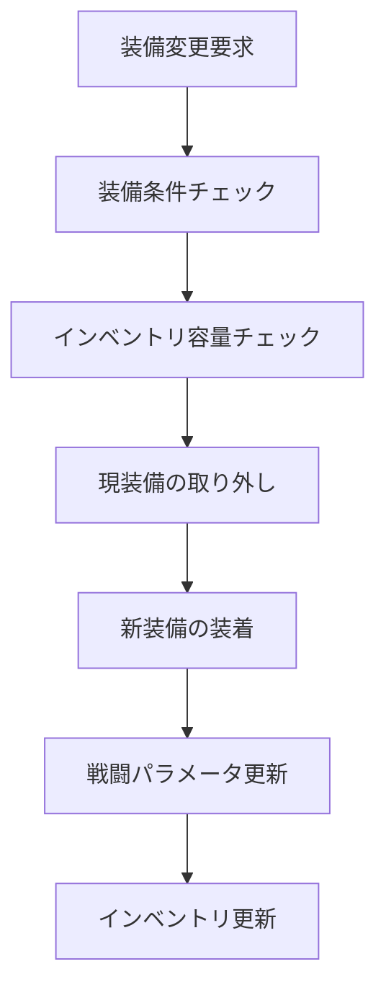

# 装備システム (Equipment System)【部分実装】

## 概要

装備システムは、Character、Item、Inventory の3つのドメインを統合し、プレイヤーの装備管理を行うシステムです。

※ **基本的な装備機能は実装済みですが、高度な統合機能や最適化機能は未実装です。**\
装備の着脱、効果適用、制限チェック、インベントリ間の移動を統合的に処理します。

## システム構成

### 関連ドメイン

- **[Character](../domains/Character.md)**: 装備条件、戦闘パラメータへの効果適用
- **[Item](../domains/Item.md)**: 装備品、強化パラメータ、装備種別
- **[Inventory](../domains/Inventory.md)**: 装備インベントリ、一般インベントリ

### 統合フロー



## 装備統合サービス

### EquipmentIntegrationService【未実装】
複数ドメインを統合した装備管理の中核サービス。

```csharp
// 【未実装】装備統合サービス - 基本機能は個別クラスに存在
public class EquipmentIntegrationService
{
    public EquipmentChangeResult ChangeEquipment(
        PlayerCommonEntity player,
        EquipmentInventory equipmentInventory,
        InfiniteSlotInventory generalInventory,
        EquippableItem newEquipment)
    {
        // 1. 装備条件チェック（Character ドメイン）
        if (!CanEquipItem(player, newEquipment))
        {
            var reason = GetEquipmentRestrictionReason(player, newEquipment);
            return EquipmentChangeResult.Failed(reason);
        }
        
        // 2. インベントリ存在チェック（Inventory ドメイン）
        if (generalInventory.GetItemQuantity(newEquipment) < 1)
        {
            return EquipmentChangeResult.Failed("Item not found in inventory");
        }
        
        // 3. 現在の装備取り外し
        var (updatedEquipment, updatedGeneral) = UnequipCurrentItem(
            equipmentInventory, generalInventory, newEquipment.EquipmentType);
        
        // 4. 新装備の装着
        try
        {
            updatedGeneral = updatedGeneral.RemoveItem(newEquipment, 1);
            updatedEquipment = updatedEquipment.EquipItem(newEquipment);
        }
        catch (InvalidOperationException ex)
        {
            return EquipmentChangeResult.Failed($"Failed to equip item: {ex.Message}");
        }
        
        // 5. 戦闘パラメータの再計算
        var updatedBattleParameters = RecalculateBattleParameters(player, updatedEquipment);
        
        return EquipmentChangeResult.Success(
            updatedEquipment,
            updatedGeneral,
            updatedBattleParameters,
            $"Successfully equipped {newEquipment.ItemName}"
        );
    }
    
    public EquipmentChangeResult UnequipItem(
        EquipmentInventory equipmentInventory,
        InfiniteSlotInventory generalInventory,
        EquipmentType equipmentType)
    {
        // 現在装備中のアイテム取得
        var currentItem = GetCurrentlyEquippedItem(equipmentInventory, equipmentType);
        if (currentItem == null)
        {
            return EquipmentChangeResult.Failed("No item equipped in this slot");
        }
        
        // インベントリ容量チェック
        if (!generalInventory.CanAddItem(currentItem, 1))
        {
            return EquipmentChangeResult.Failed("Insufficient inventory space");
        }
        
        // 装備取り外し
        var updatedEquipment = equipmentInventory.UnequipItem(equipmentType);
        var updatedGeneral = generalInventory.AddItem(currentItem, 1);
        
        return EquipmentChangeResult.Success(
            updatedEquipment,
            updatedGeneral,
            null, // 戦闘パラメータは外部で再計算
            $"Successfully unequipped {currentItem.ItemName}"
        );
    }
    
    private bool CanEquipItem(PlayerCommonEntity player, EquippableItem equipment)
    {
        // 基本装備条件チェック（将来拡張）
        // 現在は制限なしだが、レベル・ステータス要件を追加可能
        return true;
    }
    
    private string GetEquipmentRestrictionReason(PlayerCommonEntity player, EquippableItem equipment)
    {
        // 装備制限の詳細理由を返す（将来拡張）
        return "Equipment requirements not met";
    }
    
    private (EquipmentInventory, InfiniteSlotInventory) UnequipCurrentItem(
        EquipmentInventory equipmentInventory,
        InfiniteSlotInventory generalInventory,
        EquipmentType equipmentType)
    {
        var currentItem = GetCurrentlyEquippedItem(equipmentInventory, equipmentType);
        
        if (currentItem == null)
            return (equipmentInventory, generalInventory);
        
        var updatedEquipment = equipmentInventory.UnequipItem(equipmentType);
        var updatedGeneral = generalInventory.AddItem(currentItem, 1);
        
        return (updatedEquipment, updatedGeneral);
    }
    
    private EquippableItem? GetCurrentlyEquippedItem(
        EquipmentInventory equipmentInventory,
        EquipmentType equipmentType)
    {
        return equipmentType switch
        {
            EquipmentType.Weapon => equipmentInventory.WeaponSlot,
            EquipmentType.Armor => equipmentInventory.ArmorSlot,
            EquipmentType.Accessary => equipmentInventory.AccessarySlot,
            _ => null
        };
    }
    
    private BattleParameter RecalculateBattleParameters(
        PlayerCommonEntity player,
        EquipmentInventory equipment)
    {
        // Character ドメインの基本パラメータ
        var baseParams = new BattleParameter(
            maxHealth: player.Level.Value * 10,
            attackValue: (player.Strength.Value + player.Agility.Value) * 2,
            defenseValue: (player.Strength.Value + player.Agility.Value) * 2
        );
        
        // Item ドメインの装備効果
        var equipmentBonus = CalculateEquipmentBonus(equipment);
        
        return new BattleParameter(
            Math.Max(1, baseParams.MaxHealth + equipmentBonus.MaxHealth),
            Math.Max(1, baseParams.AttackValue + equipmentBonus.AttackValue),
            Math.Max(0, baseParams.DefenseValue + equipmentBonus.DefenseValue)
        );
    }
    
    private BattleParameter CalculateEquipmentBonus(EquipmentInventory equipment)
    {
        var totalAttack = 0;
        var totalDefense = 0;
        
        if (equipment.WeaponSlot != null)
        {
            totalAttack += equipment.WeaponSlot.Enhancement.GetAttackValue();
            totalDefense += equipment.WeaponSlot.Enhancement.GetDefenseValue();
        }
        
        if (equipment.ArmorSlot != null)
        {
            totalAttack += equipment.ArmorSlot.Enhancement.GetAttackValue();
            totalDefense += equipment.ArmorSlot.Enhancement.GetDefenseValue();
        }
        
        if (equipment.AccessarySlot != null)
        {
            totalAttack += equipment.AccessarySlot.Enhancement.GetAttackValue();
            totalDefense += equipment.AccessarySlot.Enhancement.GetDefenseValue();
        }
        
        return new BattleParameter(0, totalAttack, totalDefense);
    }
}
```

## 装備比較システム【未実装】

### EquipmentComparisonService【未実装】
装備品の性能比較を行うサービス。

```csharp
// 【未実装】装備比較サービス
public class EquipmentComparisonService
{
    public EquipmentComparison CompareEquipment(
        PlayerCommonEntity player,
        EquipmentInventory currentEquipment,
        EquippableItem candidateItem)
    {
        var equipmentType = candidateItem.EquipmentType;
        var currentItem = GetCurrentlyEquippedItem(currentEquipment, equipmentType);
        
        // 現在の戦闘パラメータ
        var currentParams = CalculateParametersWithEquipment(player, currentEquipment);
        
        // 候補装備での戦闘パラメータ
        var candidateEquipment = SimulateEquipmentChange(currentEquipment, candidateItem);
        var candidateParams = CalculateParametersWithEquipment(player, candidateEquipment);
        
        // 変化量計算
        var healthDiff = candidateParams.MaxHealth - currentParams.MaxHealth;
        var attackDiff = candidateParams.AttackValue - currentParams.AttackValue;
        var defenseDiff = candidateParams.DefenseValue - currentParams.DefenseValue;
        
        return new EquipmentComparison(
            currentItem,
            candidateItem,
            new ParameterDifference(healthDiff, attackDiff, defenseDiff),
            DetermineOverallImprovement(healthDiff, attackDiff, defenseDiff)
        );
    }
    
    public IEnumerable<EquipmentUpgrade> FindUpgrades(
        PlayerCommonEntity player,
        EquipmentInventory currentEquipment,
        InfiniteSlotInventory availableItems)
    {
        var upgrades = new List<EquipmentUpgrade>();
        
        // 利用可能な装備品を全チェック
        var equipmentItems = availableItems.Slots
            .Where(slot => slot.Item is EquippableItem)
            .Select(slot => (EquippableItem)slot.Item);
        
        foreach (var item in equipmentItems)
        {
            var comparison = CompareEquipment(player, currentEquipment, item);
            
            if (comparison.OverallImprovement > 0)
            {
                upgrades.Add(new EquipmentUpgrade(item, comparison));
            }
        }
        
        // 改善度で降順ソート
        return upgrades.OrderByDescending(u => u.Comparison.OverallImprovement);
    }
    
    private EquipmentInventory SimulateEquipmentChange(
        EquipmentInventory currentEquipment,
        EquippableItem candidateItem)
    {
        return candidateItem.EquipmentType switch
        {
            EquipmentType.Weapon => currentEquipment with { WeaponSlot = candidateItem },
            EquipmentType.Armor => currentEquipment with { ArmorSlot = candidateItem },
            EquipmentType.Accessary => currentEquipment with { AccessarySlot = candidateItem },
            _ => currentEquipment
        };
    }
    
    private BattleParameter CalculateParametersWithEquipment(
        PlayerCommonEntity player,
        EquipmentInventory equipment)
    {
        // 戦闘パラメータ計算（BattleSystemと連携）
        var baseParams = new BattleParameter(
            player.Level.Value * 10,
            (player.Strength.Value + player.Agility.Value) * 2,
            (player.Strength.Value + player.Agility.Value) * 2
        );
        
        var equipmentBonus = CalculateEquipmentBonus(equipment);
        
        return new BattleParameter(
            baseParams.MaxHealth + equipmentBonus.MaxHealth,
            baseParams.AttackValue + equipmentBonus.AttackValue,
            baseParams.DefenseValue + equipmentBonus.DefenseValue
        );
    }
    
    private BattleParameter CalculateEquipmentBonus(EquipmentInventory equipment)
    {
        var totalAttack = 0;
        var totalDefense = 0;
        
        if (equipment.WeaponSlot != null)
        {
            totalAttack += equipment.WeaponSlot.Enhancement.GetAttackValue();
            totalDefense += equipment.WeaponSlot.Enhancement.GetDefenseValue();
        }
        
        if (equipment.ArmorSlot != null)
        {
            totalAttack += equipment.ArmorSlot.Enhancement.GetAttackValue();
            totalDefense += equipment.ArmorSlot.Enhancement.GetDefenseValue();
        }
        
        if (equipment.AccessarySlot != null)
        {
            totalAttack += equipment.AccessarySlot.Enhancement.GetAttackValue();
            totalDefense += equipment.AccessarySlot.Enhancement.GetDefenseValue();
        }
        
        return new BattleParameter(0, totalAttack, totalDefense);
    }
    
    private EquippableItem? GetCurrentlyEquippedItem(
        EquipmentInventory equipment,
        EquipmentType equipmentType)
    {
        return equipmentType switch
        {
            EquipmentType.Weapon => equipment.WeaponSlot,
            EquipmentType.Armor => equipment.ArmorSlot,
            EquipmentType.Accessary => equipment.AccessarySlot,
            _ => null
        };
    }
    
    private int DetermineOverallImprovement(int healthDiff, int attackDiff, int defenseDiff)
    {
        // 重み付けによる総合改善度計算
        return (healthDiff / 10) + (attackDiff * 2) + (defenseDiff * 2);
    }
}
```

## 装備セット効果システム【未実装】（将来拡張）

### EquipmentSetService【未実装】

```csharp
// 【未実装】装備セット効果システム
public class EquipmentSetService
{
    public SetEffectResult CalculateSetEffects(EquipmentInventory equipment)
    {
        var setEffects = new List<SetEffect>();
        
        // セット装備の判定
        var equippedSets = DetectEquipmentSets(equipment);
        
        foreach (var set in equippedSets)
        {
            var effect = CalculateSetEffect(set);
            if (effect != null)
                setEffects.Add(effect);
        }
        
        return new SetEffectResult(setEffects);
    }
    
    private IEnumerable<EquipmentSet> DetectEquipmentSets(EquipmentInventory equipment)
    {
        // 装備セットの検出（将来実装）
        // 例: "ドラゴンセット"、"魔法使いセット" など
        return Enumerable.Empty<EquipmentSet>();
    }
    
    private SetEffect? CalculateSetEffect(EquipmentSet set)
    {
        // セット効果の計算（将来実装）
        return null;
    }
}

public record EquipmentSet
{
    public string SetName { get; }
    public ImmutableArray<EquippableItem> Items { get; }
    public int EquippedCount { get; }
    public int RequiredCount { get; }
}

public record SetEffect
{
    public string EffectName { get; }
    public BattleStatusEffectModel StatusEffect { get; }
    public bool IsActive { get; }
}

public record SetEffectResult
{
    public IReadOnlyList<SetEffect> Effects { get; }
    
    public SetEffectResult(IReadOnlyList<SetEffect> effects)
    {
        Effects = effects;
    }
    
    public BattleStatusEffectModel GetCombinedSetEffect()
    {
        var activeEffects = Effects
            .Where(e => e.IsActive)
            .Select(e => e.StatusEffect);
        
        return BattleStatusEffectModel.Combine(activeEffects);
    }
}
```

## 装備条件システム【未実装】（将来拡張）

### EquipmentRequirementChecker【未実装】

```csharp
// 【未実装】装備条件チェッカー
public class EquipmentRequirementChecker
{
    public RequirementCheckResult CheckRequirements(
        PlayerCommonEntity player,
        EquippableItem equipment)
    {
        var failures = new List<string>();
        
        // レベル要件チェック
        if (equipment.Requirements?.RequiredLevel != null &&
            player.Level.Value < equipment.Requirements.RequiredLevel.Value)
        {
            failures.Add($"Required level: {equipment.Requirements.RequiredLevel.Value} (Current: {player.Level.Value})");
        }
        
        // ステータス要件チェック
        if (equipment.Requirements?.RequiredStrength != null &&
            player.Strength.Value < equipment.Requirements.RequiredStrength.Value)
        {
            failures.Add($"Required strength: {equipment.Requirements.RequiredStrength.Value} (Current: {player.Strength.Value})");
        }
        
        if (equipment.Requirements?.RequiredAgility != null &&
            player.Agility.Value < equipment.Requirements.RequiredAgility.Value)
        {
            failures.Add($"Required agility: {equipment.Requirements.RequiredAgility.Value} (Current: {player.Agility.Value})");
        }
        
        // スキル要件チェック
        if (equipment.Requirements?.RequiredSkills != null)
        {
            foreach (var requiredSkill in equipment.Requirements.RequiredSkills)
            {
                var playerSkill = player.Skills.FirstOrDefault(s => 
                    s.Skill.Name.Value == requiredSkill.Skill.Name.Value);
                
                if (playerSkill == null)
                {
                    failures.Add($"Required skill: {requiredSkill.Skill.Name.Value}");
                }
                else if (playerSkill.Proficiency.Value < requiredSkill.Proficiency.Value)
                {
                    failures.Add($"Required {requiredSkill.Skill.Name.Value} proficiency: {requiredSkill.Proficiency.Value} (Current: {playerSkill.Proficiency.Value})");
                }
            }
        }
        
        return new RequirementCheckResult(failures.Count == 0, failures);
    }
}

public record RequirementCheckResult
{
    public bool CanEquip { get; }
    public IReadOnlyList<string> FailureReasons { get; }
    
    public RequirementCheckResult(bool canEquip, IReadOnlyList<string> failureReasons)
    {
        CanEquip = canEquip;
        FailureReasons = failureReasons;
    }
}

// 将来拡張用の装備要件
public record EquipmentRequirements
{
    public PlayerLevel? RequiredLevel { get; }
    public Strength? RequiredStrength { get; }
    public Agility? RequiredAgility { get; }
    public ImmutableArray<SkillAndProficiency>? RequiredSkills { get; }
}
```

## 結果処理【部分実装】

### EquipmentChangeResult【部分実装】

```csharp
public record EquipmentChangeResult
{
    public bool IsSuccess { get; }
    public string Message { get; }
    public EquipmentInventory? UpdatedEquipment { get; }
    public InfiniteSlotInventory? UpdatedInventory { get; }
    public BattleParameter? UpdatedBattleParameters { get; }
    
    private EquipmentChangeResult(
        bool isSuccess,
        string message,
        EquipmentInventory? updatedEquipment = null,
        InfiniteSlotInventory? updatedInventory = null,
        BattleParameter? updatedBattleParameters = null)
    {
        IsSuccess = isSuccess;
        Message = message;
        UpdatedEquipment = updatedEquipment;
        UpdatedInventory = updatedInventory;
        UpdatedBattleParameters = updatedBattleParameters;
    }
    
    public static EquipmentChangeResult Success(
        EquipmentInventory equipment,
        InfiniteSlotInventory inventory,
        BattleParameter? battleParams,
        string message) =>
        new(true, message, equipment, inventory, battleParams);
    
    public static EquipmentChangeResult Failed(string reason) =>
        new(false, reason);
}

public record EquipmentComparison
{
    public EquippableItem? CurrentItem { get; }
    public EquippableItem CandidateItem { get; }
    public ParameterDifference Difference { get; }
    public int OverallImprovement { get; }
    
    public EquipmentComparison(
        EquippableItem? currentItem,
        EquippableItem candidateItem,
        ParameterDifference difference,
        int overallImprovement)
    {
        CurrentItem = currentItem;
        CandidateItem = candidateItem;
        Difference = difference;
        OverallImprovement = overallImprovement;
    }
}

public record ParameterDifference
{
    public int HealthDifference { get; }
    public int AttackDifference { get; }
    public int DefenseDifference { get; }
    
    public ParameterDifference(int healthDiff, int attackDiff, int defenseDiff)
    {
        HealthDifference = healthDiff;
        AttackDifference = attackDiff;
        DefenseDifference = defenseDiff;
    }
    
    public bool HasAnyImprovement => 
        HealthDifference > 0 || AttackDifference > 0 || DefenseDifference > 0;
}

public record EquipmentUpgrade
{
    public EquippableItem Item { get; }
    public EquipmentComparison Comparison { get; }
    
    public EquipmentUpgrade(EquippableItem item, EquipmentComparison comparison)
    {
        Item = item;
        Comparison = comparison;
    }
}
```

## 装備管理UI支援【未実装】

### EquipmentDisplayService【未実装】（UI層支援）

```csharp
// 【未実装】装備表示UI支援サービス
public class EquipmentDisplayService
{
    public EquipmentSummary GetEquipmentSummary(
        PlayerCommonEntity player,
        EquipmentInventory equipment)
    {
        var totalStats = CalculateEquipmentBonus(equipment);
        var recommendations = GetEquipmentRecommendations(player, equipment);
        
        return new EquipmentSummary(
            equipment,
            totalStats,
            recommendations
        );
    }
    
    public string FormatParameterChange(ParameterDifference difference)
    {
        var changes = new List<string>();
        
        if (difference.HealthDifference != 0)
        {
            var symbol = difference.HealthDifference > 0 ? "+" : "";
            changes.Add($"HP: {symbol}{difference.HealthDifference}");
        }
        
        if (difference.AttackDifference != 0)
        {
            var symbol = difference.AttackDifference > 0 ? "+" : "";
            changes.Add($"ATK: {symbol}{difference.AttackDifference}");
        }
        
        if (difference.DefenseDifference != 0)
        {
            var symbol = difference.DefenseDifference > 0 ? "+" : "";
            changes.Add($"DEF: {symbol}{difference.DefenseDifference}");
        }
        
        return string.Join(", ", changes);
    }
    
    private BattleParameter CalculateEquipmentBonus(EquipmentInventory equipment)
    {
        // 装備による総合補正値計算
        return new BattleParameter(0, 0, 0); // 実装は他メソッドと同様
    }
    
    private IEnumerable<string> GetEquipmentRecommendations(
        PlayerCommonEntity player,
        EquipmentInventory equipment)
    {
        var recommendations = new List<string>();
        
        // 空きスロットの推奨
        if (equipment.WeaponSlot == null)
            recommendations.Add("武器を装備することで攻撃力が向上します");
        
        if (equipment.ArmorSlot == null)
            recommendations.Add("防具を装備することで防御力が向上します");
        
        if (equipment.AccessarySlot == null)
            recommendations.Add("アクセサリを装備することで特殊効果が得られます");
        
        return recommendations;
    }
}

public record EquipmentSummary
{
    public EquipmentInventory Equipment { get; }
    public BattleParameter TotalBonus { get; }
    public IEnumerable<string> Recommendations { get; }
    
    public EquipmentSummary(
        EquipmentInventory equipment,
        BattleParameter totalBonus,
        IEnumerable<string> recommendations)
    {
        Equipment = equipment;
        TotalBonus = totalBonus;
        Recommendations = recommendations;
    }
}
```

## 拡張ポイント【未実装】

### 装備プリセットシステム【未実装】
```csharp
public record EquipmentPreset
{
    public string Name { get; }
    public EquipmentInventory Configuration { get; }
    public string Purpose { get; } // "戦闘用", "生産用" など
}
```

### 装備強化予約システム【未実装】
```csharp
public class EquipmentEnhancementQueue
{
    public void QueueEnhancement(EquippableItem item, EnhancementPlan plan);
    public void ProcessQueue(PlayerCommonEntity player, InfiniteSlotInventory inventory);
}
```

装備システムは、プレイヤーの戦闘力向上と戦略的な装備選択を支援する重要なシステムです。\
複数ドメインの連携により、直感的で効率的な装備管理を実現します。