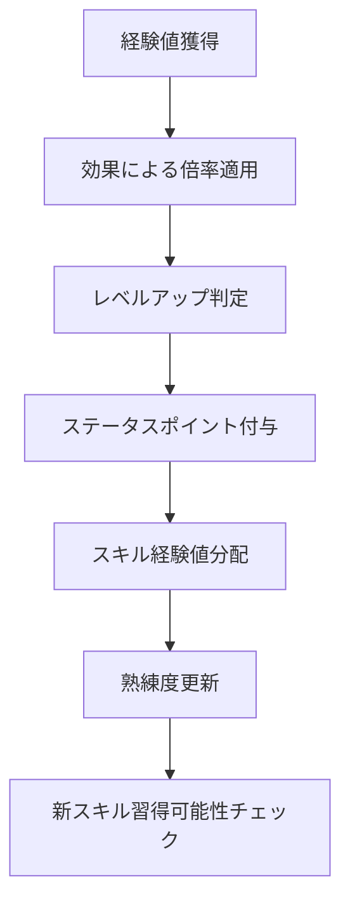

# レベリングシステム (Leveling System)

## 概要

レベリングシステムは、Character、Skill、PassiveEffect の3つのドメインを統合し、プレイヤーの成長と進歩を管理するシステムです。経験値獲得、レベルアップ、ステータス振り分け、スキル経験値、効果による成長補正を統合的に処理します。

## システム構成

### 関連ドメイン

- **[Character](../domains/Character.md)**: 経験値、レベル、ステータスポイント
- **[Skill](../domains/Skill.md)**: スキル経験値、熟練度向上
- **[PassiveEffect](../domains/PassiveEffect.md)**: 経験値倍率効果

### 統合フロー



## レベリング統合サービス

### LevelingIntegrationService
複数ドメインを統合した成長管理の中核サービス。

```csharp
public class LevelingIntegrationService
{
    public LevelingResult ProcessExperienceGain(
        PlayerCommonEntity player,
        EffectCollection effects,
        int baseExperience,
        ExperienceSource source)
    {
        // 1. 効果による経験値倍率適用（PassiveEffect ドメイン）
        var multiplier = CalculateExperienceMultiplier(effects);
        var finalExperience = (int)(baseExperience * multiplier);
        
        // 2. キャラクター経験値更新（Character ドメイン）
        var characterResult = ProcessCharacterExperience(player, finalExperience);
        
        // 3. スキル経験値処理（Skill ドメイン）
        var skillResult = ProcessSkillExperience(
            characterResult.UpdatedPlayer, source, finalExperience);
        
        // 4. レベルアップ効果適用
        var levelUpEffects = ApplyLevelUpEffects(
            player, characterResult.UpdatedPlayer, effects);
        
        return new LevelingResult(
            skillResult.UpdatedPlayer,
            levelUpEffects,
            characterResult.LevelUpsGained,
            characterResult.ExperienceGained,
            skillResult.SkillImprovements,
            GetLevelingMessage(characterResult, skillResult)
        );
    }
    
    public StatusAllocationResult AllocateStatusPoints(
        PlayerCommonEntity player,
        int strengthIncrease,
        int agilityIncrease)
    {
        try
        {
            // Character ドメインのステータス配分ルール適用
            var updatedPlayer = player.AllocateStatus(strengthIncrease, agilityIncrease);
            
            // 配分後の新スキル習得可能性チェック
            var newLearnableSkills = CheckNewLearnableSkills(player, updatedPlayer);
            
            return StatusAllocationResult.Success(
                updatedPlayer,
                newLearnableSkills,
                $"Successfully allocated {strengthIncrease + agilityIncrease} status points"
            );
        }
        catch (InvalidOperationException ex)
        {
            return StatusAllocationResult.Failed(ex.Message);
        }
    }
    
    private float CalculateExperienceMultiplier(EffectCollection effects)
    {
        // PassiveEffect ドメインの経験値倍率効果統合
        var combinedEffect = effects.GetCombinedEffect();
        return Math.Max(0.1f, combinedEffect.ExperienceMultiplier);
    }
    
    private CharacterExperienceResult ProcessCharacterExperience(
        PlayerCommonEntity player,
        int experience)
    {
        var originalLevel = player.Level.Value;
        var updatedPlayer = player.ProcessLevelUp(experience);
        var levelUpsGained = updatedPlayer.Level.Value - originalLevel;
        
        return new CharacterExperienceResult(
            updatedPlayer,
            experience,
            levelUpsGained
        );
    }
    
    private SkillExperienceResult ProcessSkillExperience(
        PlayerCommonEntity player,
        ExperienceSource source,
        int totalExperience)
    {
        var improvements = new List<SkillImprovement>();
        var updatedPlayer = player;
        
        // 経験値源に応じたスキル経験値分配
        var skillDistribution = CalculateSkillExperienceDistribution(source, totalExperience);
        
        foreach (var (skillType, experience) in skillDistribution)
        {
            var relevantSkills = GetRelevantSkills(player, skillType);
            
            foreach (var skill in relevantSkills)
            {
                var improvement = ProcessSingleSkillImprovement(
                    updatedPlayer, skill.Skill.Name, experience);
                
                if (improvement.ProficiencyGained > 0)
                {
                    improvements.Add(improvement);
                    updatedPlayer = improvement.UpdatedPlayer;
                }
            }
        }
        
        return new SkillExperienceResult(updatedPlayer, improvements);
    }
    
    private Dictionary<SkillType, int> CalculateSkillExperienceDistribution(
        ExperienceSource source,
        int totalExperience)
    {
        return source switch
        {
            ExperienceSource.Combat => new Dictionary<SkillType, int>
            {
                { SkillType.Battle, (int)(totalExperience * 0.8f) }
            },
            ExperienceSource.Crafting => new Dictionary<SkillType, int>
            {
                { SkillType.Production, (int)(totalExperience * 0.6f) }
            },
            ExperienceSource.Quest => new Dictionary<SkillType, int>
            {
                { SkillType.Battle, (int)(totalExperience * 0.3f) },
                { SkillType.Production, (int)(totalExperience * 0.2f) }
            },
            _ => new Dictionary<SkillType, int>()
        };
    }
    
    private IEnumerable<SkillAndProficiency> GetRelevantSkills(
        PlayerCommonEntity player,
        SkillType skillType)
    {
        return player.Skills.Where(s => s.Skill.Type == skillType);
    }
    
    private SkillImprovement ProcessSingleSkillImprovement(
        PlayerCommonEntity player,
        SkillName skillName,
        int experience)
    {
        try
        {
            var originalSkill = player.Skills.First(s => s.Skill.Name.Value == skillName.Value);
            var originalProficiency = originalSkill.Proficiency.Value;
            
            var updatedPlayer = SkillLearningService.ImproveSkill(player, skillName, experience);
            var updatedSkill = updatedPlayer.Skills.First(s => s.Skill.Name.Value == skillName.Value);
            var newProficiency = updatedSkill.Proficiency.Value;
            
            return new SkillImprovement(
                updatedPlayer,
                originalSkill.Skill,
                originalProficiency,
                newProficiency,
                newProficiency - originalProficiency,
                experience
            );
        }
        catch (InvalidOperationException)
        {
            return new SkillImprovement(
                player,
                null,
                0,
                0,
                0,
                0
            );
        }
    }
    
    private EffectCollection ApplyLevelUpEffects(
        PlayerCommonEntity originalPlayer,
        PlayerCommonEntity updatedPlayer,
        EffectCollection currentEffects)
    {
        var levelUpsGained = updatedPlayer.Level.Value - originalPlayer.Level.Value;
        
        if (levelUpsGained <= 0)
            return currentEffects;
        
        // レベルアップボーナス効果（一時的なバフ）
        var levelUpBuff = EffectFactory.CreateExperienceBoost(1.2f, 10); // 10ターンの間20%経験値ボーナス
        
        return currentEffects.AddEffect(levelUpBuff);
    }
    
    private IEnumerable<Skill> CheckNewLearnableSkills(
        PlayerCommonEntity originalPlayer,
        PlayerCommonEntity updatedPlayer)
    {
        // ステータス変更により新たに習得可能になったスキルを検出
        // 実装は将来拡張（全スキルデータベースが必要）
        return Enumerable.Empty<Skill>();
    }
    
    private string GetLevelingMessage(
        CharacterExperienceResult characterResult,
        SkillExperienceResult skillResult)
    {
        var messages = new List<string>();
        
        if (characterResult.LevelUpsGained > 0)
        {
            messages.Add($"Level up! (Level {characterResult.UpdatedPlayer.Level.Value})");
            messages.Add($"Gained {characterResult.LevelUpsGained * 3} status points");
        }
        
        var significantSkillUps = skillResult.SkillImprovements
            .Where(s => s.ProficiencyGained >= 10);
        
        foreach (var skillUp in significantSkillUps)
        {
            if (skillUp.Skill != null)
            {
                messages.Add($"{skillUp.Skill.Name.Value} improved to {skillUp.NewProficiency}");
            }
        }
        
        return string.Join(" | ", messages);
    }
}
```

## 経験値計算システム

### ExperienceCalculationService
様々な活動による経験値計算を統合管理。

```csharp
public class ExperienceCalculationService
{
    public int CalculateCombatExperience(
        PlayerCommonEntity player,
        int enemyLevel,
        bool isVictory,
        CombatContext context)
    {
        // 基本戦闘経験値
        var baseExperience = isVictory ? 100 : 25; // 勝利時は100、敗北時は25
        
        // レベル差補正（Character ドメインのルール）
        var levelDifferenceMultiplier = CalculateExperienceMultiplier(player.Level.Value, enemyLevel);
        
        // 戦闘効率補正
        var efficiencyMultiplier = CalculateCombatEfficiency(context);
        
        return (int)(baseExperience * levelDifferenceMultiplier * efficiencyMultiplier);
    }
    
    public int CalculateCraftingExperience(
        ICraftableItem craftedItem,
        bool wasSuccessful,
        SkillProficiency craftingProficiency)
    {
        // Skill ドメインのクラフト経験値ルール適用
        return ProductionSkillService.CalculateCraftExperience(craftedItem, wasSuccessful);
    }
    
    public int CalculateQuestExperience(
        QuestModel completedQuest,
        PlayerCommonEntity player)
    {
        var baseExperience = completedQuest.Difficulty switch
        {
            QuestDifficulty.Easy => 50,
            QuestDifficulty.Normal => 100,
            QuestDifficulty.Hard => 200,
            QuestDifficulty.Expert => 400,
            QuestDifficulty.Master => 800,
            _ => 50
        };
        
        // 完了時間ボーナス
        var timeBonus = CalculateQuestTimeBonus(completedQuest);
        
        return (int)(baseExperience * timeBonus);
    }
    
    public int CalculateExplorationExperience(
        FieldID discoveredField,
        PlayerCommonEntity player)
    {
        // 新エリア発見による経験値
        var baseExperience = 30;
        
        // プレイヤーレベルによるスケーリング
        var levelScaling = Math.Max(0.5f, 1.0f - (player.Level.Value - 1) * 0.02f);
        
        return (int)(baseExperience * levelScaling);
    }
    
    private float CalculateExperienceMultiplier(int playerLevel, int enemyLevel)
    {
        // Character ドメインの敵レベル差経験値倍率ルール
        var levelDifference = enemyLevel - playerLevel;
        
        if (levelDifference > 0)
        {
            return Math.Min(2.0f, 1.0f + (levelDifference * 0.1f)); // 最大200%
        }
        else if (levelDifference < 0)
        {
            return Math.Max(0.1f, 1.0f + (levelDifference * 0.05f)); // 最低10%
        }
        
        return 1.0f;
    }
    
    private float CalculateCombatEfficiency(CombatContext context)
    {
        var efficiency = 1.0f;
        
        // 戦闘時間による補正
        if (context.CombatDuration < TimeSpan.FromSeconds(30))
            efficiency *= 1.2f; // 素早い勝利にボーナス
        
        // ダメージ効率による補正
        if (context.DamageDealtRatio > 0.8f)
            efficiency *= 1.1f; // 効率的な戦闘にボーナス
        
        return efficiency;
    }
    
    private float CalculateQuestTimeBonus(QuestModel quest)
    {
        if (quest.Deadline == null || quest.CompletedAt == null)
            return 1.0f;
        
        var timeUsed = quest.CompletedAt.Value - (quest.AcceptedAt ?? quest.CreatedAt);
        var timeAllowed = quest.Deadline.Value - quest.CreatedAt;
        
        var efficiency = 1.0 - (timeUsed.TotalMinutes / timeAllowed.TotalMinutes);
        
        return efficiency switch
        {
            > 0.8 => 1.5f,  // 素早い完了
            > 0.6 => 1.2f,  // 効率的な完了
            > 0.4 => 1.0f,  // 標準的な完了
            _ => 0.8f       // 遅い完了
        };
    }
}

public record CombatContext
{
    public TimeSpan CombatDuration { get; }
    public float DamageDealtRatio { get; }
    public bool UsedSkills { get; }
    public int ComboCount { get; }
    
    public CombatContext(
        TimeSpan duration,
        float damageRatio,
        bool usedSkills = false,
        int comboCount = 0)
    {
        CombatDuration = duration;
        DamageDealtRatio = Math.Clamp(damageRatio, 0f, 1f);
        UsedSkills = usedSkills;
        ComboCount = comboCount;
    }
}

public enum ExperienceSource
{
    Combat,      // 戦闘
    Crafting,    // クラフト
    Quest,       // クエスト
    Exploration, // 探索
    Event        // イベント
}
```

## 成長予測システム

### GrowthProjectionService
プレイヤーの成長予測と最適化提案。

```csharp
public class GrowthProjectionService
{
    public GrowthProjection ProjectNextLevel(PlayerCommonEntity player)
    {
        var currentExperience = player.Experience.Value;
        var currentLevel = player.Level.Value;
        var nextLevelExperience = CalculateRequiredExperience(currentLevel + 1);
        var experienceNeeded = nextLevelExperience - currentExperience;
        
        // 現在の経験値獲得率から推定
        var projectedTime = EstimateTimeToNextLevel(player, experienceNeeded);
        
        return new GrowthProjection(
            currentLevel + 1,
            experienceNeeded,
            projectedTime,
            GetOptimalActivities(player, experienceNeeded)
        );
    }
    
    public StatusGrowthAnalysis AnalyzeStatusGrowth(PlayerCommonEntity player)
    {
        var currentPoints = player.StatusPoint.Value;
        var strengthGrowthOptions = GenerateStatusOptions(player, true, currentPoints);
        var agilityGrowthOptions = GenerateStatusOptions(player, false, currentPoints);
        var balancedGrowthOptions = GenerateBalancedOptions(player, currentPoints);
        
        return new StatusGrowthAnalysis(
            strengthGrowthOptions,
            agilityGrowthOptions,
            balancedGrowthOptions,
            GetRecommendedAllocation(player)
        );
    }
    
    public SkillGrowthProjection ProjectSkillGrowth(
        PlayerCommonEntity player,
        SkillName targetSkill,
        int targetProficiency)
    {
        var currentSkill = player.Skills.FirstOrDefault(s => 
            s.Skill.Name.Value == targetSkill.Value);
        
        if (currentSkill == null)
            throw new ArgumentException("Skill not found");
        
        var currentProficiency = currentSkill.Proficiency.Value;
        var proficiencyNeeded = targetProficiency - currentProficiency;
        
        if (proficiencyNeeded <= 0)
            return SkillGrowthProjection.AlreadyAchieved(currentSkill);
        
        // スキル経験値要件計算（100経験値 = 1熟練度）
        var experienceNeeded = proficiencyNeeded * 100;
        
        // 推定活動回数
        var estimatedActivities = EstimateActivitiesForSkillGrowth(
            currentSkill.Skill, experienceNeeded);
        
        return new SkillGrowthProjection(
            targetSkill,
            currentProficiency,
            targetProficiency,
            experienceNeeded,
            estimatedActivities
        );
    }
    
    private int CalculateRequiredExperience(int level)
    {
        // Character ドメインの経験値計算式を使用
        if (level <= 1) return 0;
        
        const int initExpRequirement = 100;
        const float multiplier = 1.25f;
        
        var numerator = initExpRequirement * (1 - Math.Pow(multiplier, level - 1));
        var denominator = 1 - multiplier;
        
        return (int)(numerator / denominator);
    }
    
    private TimeSpan EstimateTimeToNextLevel(PlayerCommonEntity player, int experienceNeeded)
    {
        // プレイヤーの平均経験値獲得率を基に推定
        var averageExpPerHour = EstimateExperienceRate(player);
        var hoursNeeded = experienceNeeded / (float)averageExpPerHour;
        
        return TimeSpan.FromHours(hoursNeeded);
    }
    
    private int EstimateExperienceRate(PlayerCommonEntity player)
    {
        // プレイヤーレベルと活動パターンに基づく推定
        return player.Level.Value switch
        {
            <= 5 => 200,    // 初心者: 200exp/時
            <= 15 => 300,   // 中級者: 300exp/時
            <= 30 => 400,   // 上級者: 400exp/時
            _ => 500        // 熟練者: 500exp/時
        };
    }
    
    private IEnumerable<OptimalActivity> GetOptimalActivities(
        PlayerCommonEntity player,
        int experienceNeeded)
    {
        var activities = new List<OptimalActivity>();
        
        // 戦闘活動
        activities.Add(new OptimalActivity(
            "Combat Training",
            "同レベル敵との戦闘",
            100, // 1回あたり経験値
            experienceNeeded / 100 // 必要回数
        ));
        
        // クラフト活動
        var productionSkills = player.Skills.Where(s => s.Skill.Type == SkillType.Production);
        if (productionSkills.Any())
        {
            activities.Add(new OptimalActivity(
                "Crafting Practice",
                "アイテム作成練習",
                50,
                experienceNeeded / 50
            ));
        }
        
        // クエスト活動
        activities.Add(new OptimalActivity(
            "Quest Completion",
            "Normal難易度クエスト",
            100,
            experienceNeeded / 100
        ));
        
        return activities.OrderBy(a => a.EstimatedSessions);
    }
    
    private IEnumerable<StatusAllocation> GenerateStatusOptions(
        PlayerCommonEntity player,
        bool prioritizeStrength,
        int availablePoints)
    {
        var options = new List<StatusAllocation>();
        
        for (int i = 0; i <= availablePoints; i++)
        {
            var strAllocation = prioritizeStrength ? availablePoints - i : i;
            var agiAllocation = prioritizeStrength ? i : availablePoints - i;
            
            var projectedStr = player.Strength.Value + strAllocation;
            var projectedAgi = player.Agility.Value + agiAllocation;
            var projectedAttack = (projectedStr + projectedAgi) * 2;
            
            options.Add(new StatusAllocation(
                strAllocation,
                agiAllocation,
                projectedAttack,
                EstimateStatusEffectiveness(projectedStr, projectedAgi)
            ));
        }
        
        return options.OrderByDescending(o => o.Effectiveness);
    }
    
    private IEnumerable<StatusAllocation> GenerateBalancedOptions(
        PlayerCommonEntity player,
        int availablePoints)
    {
        var options = new List<StatusAllocation>();
        
        // バランス重視の配分パターン
        var patterns = new[]
        {
            (availablePoints / 2, availablePoints - availablePoints / 2),
            (availablePoints / 3, availablePoints - availablePoints / 3),
            (availablePoints * 2 / 3, availablePoints - availablePoints * 2 / 3)
        };
        
        foreach (var (str, agi) in patterns)
        {
            var projectedStr = player.Strength.Value + str;
            var projectedAgi = player.Agility.Value + agi;
            var projectedAttack = (projectedStr + projectedAgi) * 2;
            
            options.Add(new StatusAllocation(
                str,
                agi,
                projectedAttack,
                EstimateStatusEffectiveness(projectedStr, projectedAgi)
            ));
        }
        
        return options.OrderByDescending(o => o.Effectiveness);
    }
    
    private StatusAllocation GetRecommendedAllocation(PlayerCommonEntity player)
    {
        // プレイヤーの現在のバランスに基づく推奨配分
        var strAgiRatio = (float)player.Strength.Value / player.Agility.Value;
        
        var availablePoints = player.StatusPoint.Value;
        
        if (strAgiRatio < 0.8f)
        {
            // STR重視
            return new StatusAllocation(
                availablePoints * 2 / 3,
                availablePoints / 3,
                0,
                1.0f
            );
        }
        else if (strAgiRatio > 1.2f)
        {
            // AGI重視
            return new StatusAllocation(
                availablePoints / 3,
                availablePoints * 2 / 3,
                0,
                1.0f
            );
        }
        else
        {
            // バランス重視
            return new StatusAllocation(
                availablePoints / 2,
                availablePoints - availablePoints / 2,
                0,
                1.0f
            );
        }
    }
    
    private float EstimateStatusEffectiveness(int strength, int agility)
    {
        // バランスと総合力を考慮した効果度
        var total = strength + agility;
        var balance = 1.0f - Math.Abs(strength - agility) / (float)total;
        
        return total * balance;
    }
    
    private Dictionary<string, int> EstimateActivitiesForSkillGrowth(
        Skill skill,
        int experienceNeeded)
    {
        return skill.Type switch
        {
            SkillType.Battle => new Dictionary<string, int>
            {
                {"戦闘回数", experienceNeeded / 50},
                {"強敵戦闘", experienceNeeded / 100}
            },
            SkillType.Production => new Dictionary<string, int>
            {
                {"アイテム作成", experienceNeeded / 30},
                {"高難易度クラフト", experienceNeeded / 60}
            },
            _ => new Dictionary<string, int>()
        };
    }
}
```

## 結果処理

### LevelingResult & 関連クラス

```csharp
public record LevelingResult
{
    public PlayerCommonEntity UpdatedPlayer { get; }
    public EffectCollection UpdatedEffects { get; }
    public int LevelUpsGained { get; }
    public int ExperienceGained { get; }
    public IReadOnlyList<SkillImprovement> SkillImprovements { get; }
    public string Message { get; }
    
    public LevelingResult(
        PlayerCommonEntity updatedPlayer,
        EffectCollection updatedEffects,
        int levelUpsGained,
        int experienceGained,
        IReadOnlyList<SkillImprovement> skillImprovements,
        string message)
    {
        UpdatedPlayer = updatedPlayer;
        UpdatedEffects = updatedEffects;
        LevelUpsGained = levelUpsGained;
        ExperienceGained = experienceGained;
        SkillImprovements = skillImprovements;
        Message = message;
    }
    
    public bool HasLevelUp => LevelUpsGained > 0;
    public bool HasSkillImprovements => SkillImprovements.Any();
}

public record StatusAllocationResult
{
    public bool IsSuccess { get; }
    public string Message { get; }
    public PlayerCommonEntity? UpdatedPlayer { get; }
    public IEnumerable<Skill>? NewLearnableSkills { get; }
    
    private StatusAllocationResult(
        bool isSuccess,
        string message,
        PlayerCommonEntity? updatedPlayer = null,
        IEnumerable<Skill>? newLearnableSkills = null)
    {
        IsSuccess = isSuccess;
        Message = message;
        UpdatedPlayer = updatedPlayer;
        NewLearnableSkills = newLearnableSkills ?? Enumerable.Empty<Skill>();
    }
    
    public static StatusAllocationResult Success(
        PlayerCommonEntity player,
        IEnumerable<Skill> newSkills,
        string message) =>
        new(true, message, player, newSkills);
    
    public static StatusAllocationResult Failed(string reason) =>
        new(false, reason);
}

public record SkillImprovement
{
    public PlayerCommonEntity UpdatedPlayer { get; }
    public Skill? Skill { get; }
    public int OriginalProficiency { get; }
    public int NewProficiency { get; }
    public int ProficiencyGained { get; }
    public int ExperienceUsed { get; }
    
    public SkillImprovement(
        PlayerCommonEntity updatedPlayer,
        Skill? skill,
        int originalProficiency,
        int newProficiency,
        int proficiencyGained,
        int experienceUsed)
    {
        UpdatedPlayer = updatedPlayer;
        Skill = skill;
        OriginalProficiency = originalProficiency;
        NewProficiency = newProficiency;
        ProficiencyGained = proficiencyGained;
        ExperienceUsed = experienceUsed;
    }
}

public record GrowthProjection
{
    public int TargetLevel { get; }
    public int ExperienceNeeded { get; }
    public TimeSpan EstimatedTime { get; }
    public IEnumerable<OptimalActivity> RecommendedActivities { get; }
    
    public GrowthProjection(
        int targetLevel,
        int experienceNeeded,
        TimeSpan estimatedTime,
        IEnumerable<OptimalActivity> recommendedActivities)
    {
        TargetLevel = targetLevel;
        ExperienceNeeded = experienceNeeded;
        EstimatedTime = estimatedTime;
        RecommendedActivities = recommendedActivities;
    }
}

public record OptimalActivity
{
    public string ActivityName { get; }
    public string Description { get; }
    public int ExperiencePerSession { get; }
    public int EstimatedSessions { get; }
    
    public OptimalActivity(
        string activityName,
        string description,
        int experiencePerSession,
        int estimatedSessions)
    {
        ActivityName = activityName;
        Description = description;
        ExperiencePerSession = experiencePerSession;
        EstimatedSessions = estimatedSessions;
    }
}

public record StatusAllocation
{
    public int StrengthIncrease { get; }
    public int AgilityIncrease { get; }
    public int ProjectedAttackPower { get; }
    public float Effectiveness { get; }
    
    public StatusAllocation(
        int strengthIncrease,
        int agilityIncrease,
        int projectedAttackPower,
        float effectiveness)
    {
        StrengthIncrease = strengthIncrease;
        AgilityIncrease = agilityIncrease;
        ProjectedAttackPower = projectedAttackPower;
        Effectiveness = effectiveness;
    }
}
```

## 拡張ポイント

### 才能システム
```csharp
public enum Talent
{
    Warrior,    // 戦士の才能（STR成長ボーナス）
    Rogue,      // 盗賊の才能（AGI成長ボーナス）
    Balanced    // バランス型（全体的な成長）
}

public record TalentModifier
{
    public float StrengthMultiplier { get; }
    public float AgilityMultiplier { get; }
    public float ExperienceMultiplier { get; }
}
```

### 上限突破システム
```csharp
public record LevelCapBreakthrough
{
    public int NewLevelCap { get; }
    public ImmutableArray<QuestID> RequiredQuests { get; }
    public ImmutableArray<ItemAndQuantity> RequiredItems { get; }
}
```

レベリングシステムは、プレイヤーの継続的な成長と目標設定を支援する重要なシステムです。複数ドメインの連携により、深いプレイヤー成長体験を提供します。